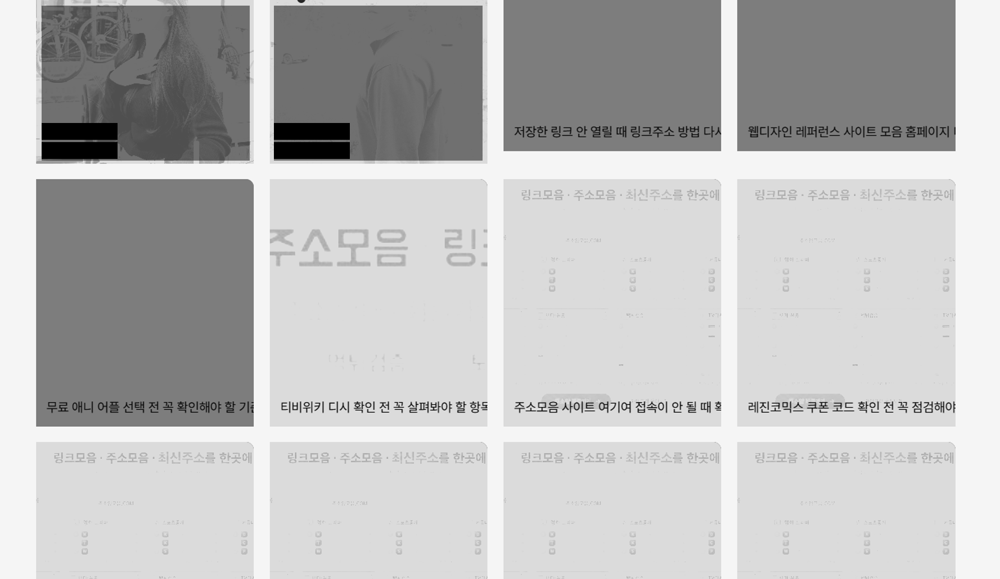
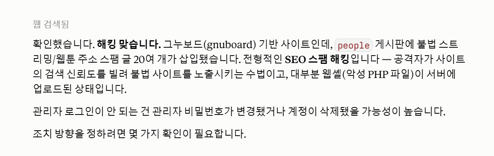
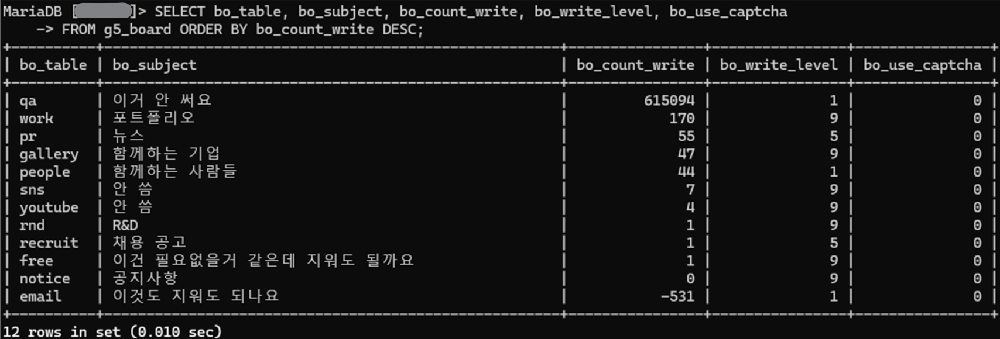
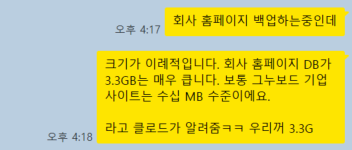
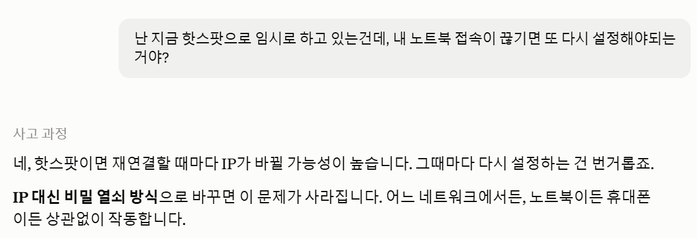
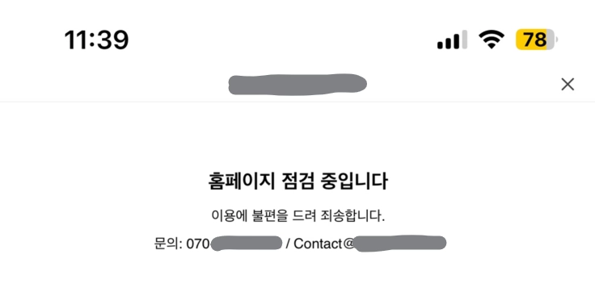

> 🚨 공연 보고 한잔하던 자리가 파할 무렵, 홈페이지가 해킹당한 것 같다는 연락을 받았다. 집에 가는 버스에서 핫스팟을 켜고 노트북을 열었다. 제한시간 30분. 클로드와 함께라면.. 문제를 해결할 수 있지 않을까?


캡처를 열었다. '함께하는 사람들' 페이지, 직원 22명 소개 아래로 불법 사이트 홍보 글이 22개 더 붙어 있었다. 



*직원 소개 게시판에 추가된 22명의 추가 직원(?)*

- 티비위키 디시 확인 전 꼭 살펴봐야 할 항목 정리
- 주소모음 사이트 여기여 접속이 안 될 때 확인해야 할 해결 방법
- 레진코믹스 쿠폰 코드 확인 전 꼭 점검해야 할 항목
- 애니 라이프 사이트 바로가기 문제 해결 방법과 다시 확인하는 순서

지우면 되겠네 싶었지만, 문제가 있었다.

1. 그누보드 관리자에서 로그인은 되는데 **글이 지워지지 않는다**고 했다. (최초 발견자의 이야기)
2. 서버를 내리자니 **다른 서비스**들과 같은 서버를 공유하고 있었다
3. 터미널에서 서버 관리자 계정으로 **로그인이 안 된다**. 비밀번호가 나도 모르게 바뀌어 있었다

3번을 확인한 순간, 뭔가 잘못 되었구나 싶었다. 뭘 하고 싶어도 제대로 할 수가 없겠구나.



*클로드에게 캡쳐해서 보여줬더니 해킹이 맞다고 했다. 나중에 알고보니 다행히 웹셸이 업로드 된 건 아니었다.*


<br>


이 글은 그날 밤부터 일주일간의 기록이다. 개발은 모르지만.. 어쩔 수 없이 회사 페이지를 관리해야 하는 나같은 사람들을 위한, 그리고 미래의 나를 위한 기록이다ㅎ


1편은 개발자가 아니더라도 **조금만 알았다면 미리 챙길 수 있었던 문제**들을 중심으로


2편은 개발적으로 어떤 문제들이 있었고, 어떻게 조치했는지에 대한 기록


3편은… 이 작업으로 인해 연쇄적으로 발생했던 다른 문제들(ㅠㅠ)에 대한 기록을 남겨보려 한다


<br>


---


# 개발자가 아니더라도, 페이지 관리를 위해 알아두면 좋을 문제점과 원인들


<br>


## 문제 1. 안 쓰는 게시판에 쌓인 61만 건의 스팸


다음 날 DB를 열어보고 알았다. 내가 본 22건은 빙산의 일각이었다.





**61만 건.** 3기가가 되는 스팸글이 한 게시판에 등록되어 있었다.


게시판 이름은 **"이거 안 써요"**. 진짜로 안 쓰는 게시판이었다. 글쓰기 권한은 누구나, 자동등록방지도 없었다. “이건 필요없을거 같은데 지워도 될까요” 라는 개발자의 메모가 그대로 남아있었다.


게시판 자체의 게 문제가 아니다. **안 쓰는 게시판을 지우지 않고, 권한을 열어둔 채로 방치한 것**이 문제였다. 클릭 두 번이면 지워지는 걸 3년간 안 지웠다가 61만 건의 스팸글을 얻었다.


스팸은 2023년 5월부터 쌓이고 있었다. 어느 날은 하루 2,400건. 36초에 한 건씩 등록되고 있었다ㄷㄷ


> ✅ 안 쓰는 게시판·페이지·폼은 잠그거나 지워야 한다.  밖에서 보이지 않는다고 해서 존재하지 않는 것이 아니다. 당장 지우기 애매하면 최소한 **글쓰기 권한**을 잘 설정해둔다. 모두에게 열어두는 대참사를 만들지 않는다.


## 문제 2. 밖에서 안 보이는 문제를 눈치채지 못했던 나


이 게시판은 외부에 노출되는 게시판이 아니었다. 메뉴에도 없고, 링크도 걸려 있지 않았다.


그래서 밖에서 보기엔 우리 홈페이지가 3년 내내 멀쩡했다. 나도 멀쩡한 줄 알았다.


관리자에서 게시판 목록과 회원 목록만 한 번 열어봤어도 알 수 있었지만, 안 쓰는 것들이니까 볼 생각 자체를 안 했다. 회원 목록을 뒤늦게 열어보니 우리 홈페이지에 **회원가입 기능**도 있었다. 회사 소개 홈페이지에, 회원 등급도 있고 포인트도 있었다. 그런 기능이 있는 줄도 몰랐다.


봇은 정상적으로 회원가입을 하고, 열린 게시판에 글쓰기 폼을 반복 호출했다. 계정 두 개가 스팸 61만 건의 98%를 작성했다. 어이없게도 아주 정당한 루트로 글을 작성한 것이다.


솔루션을 사용하면 딸려오는 기능들이 있다. 안 쓰면 없는 거라고 생각했는데, 아니었다. **안 쓰는 기능은 없는 게 아니라 방치된 기능이다.** 침투 통로가 되고, 쓸데없이 용량도 잡아먹는다.


**심지어 매일 7~8GB씩 찍히던 트래픽**을 보면서도, 근데 이게 많은 건지 적은 건지, 정상인지 비정상인지 판단하지 못했다. 오히려 어떤 날 트래픽이 특히 많이 찍히면 ‘어디에서 유입이 많이 되었나보다’라고 좋아하기 까지 했다. 지금 생각하면 얼마나 어이가 없는 일인지ㅠㅠ



*백업하다가 알게 된 건 안 비밀…*


## 문제 3. 서버를 내릴 수 없었다


가장 빠른 방법은 서버를 통째로 내리는 것이다. 방화벽에서 포트를 꺼버리면 끝난다.


그런데 그 서버에는 우리 회사의 다른 서비스까지 7개가 올라가 있었다. 홈페이지 하나 가리자고 운영 중인 서비스를 죽일 수는 없었다.

> **잠깐 닫아도 되는 사이트**와 **절대 닫으면 안 되는 서비스**가 한 서버에 있었던 것이 문제.

한 서버에 여러 사이트를 올리는 건 흔한 일이라고 한다. 그런데 관리 난이도가 다르고, 중요도가 다르고, 담당자마저 다른 것들이 섞여 있었던 게 문제였던 것 같다. 관리가 제일 허술한 사이트 하나가 뚫렸을 때 나머지가 전부 인질이 되어 버리는 셈이다.


다행히 Nginx 설정이 사이트별로 분리되어 있어서 연쇄 사고는 나지 않았지만, 문제가 없는 걸 확인하기 전까지 얼마나 마음을 졸였는지 모른다. 게다가 서버 작업을 하는 동안 상용서비스에도 서버 접속에 당연히 문제가 생긴다. 결국 복구작업을 해야했는데, 그 과정에서 1-2분 정도 모든 사이트가 닫힐 수 밖에 없었다.


서버 복구 작업까지 해야 했던 데에는 완전히 다른 이유가 있었다. 서버 관리자(root) 계정 접근이 어려웠기 때문이다. root 권한이 없으니, 계정 복구를 하기 전까지는 조치할 수 있는 게 거의 없었다. 결국 모든 서비스를 잠시 내리는 선택을 해야만 했다.


<br>


## 문제 4. 완전히 못 고쳐도, 임시조치는 할 줄 알아야 한다는 교휸


버스 안에서 같은 생각이 계속 돌았다.

> 일단 잠깐 꺼두고, 내일 해결하면 되지 않을까?  
> 이렇게 그냥 끄면 안 될 텐데…  
> 내일 다시 켰을 때 뭔가 안 되면 어떡하지?

지식이 부족하니 빠르게 판단할 수가 없었다. 무엇이 위험한 선택인지조차 모르는 상태였다.


그래서 일단 가려두기만 하기로 했다. 서버는 두고, 우리 사이트만 "점검 중입니다" 화면으로 덮는 것이다.


완전한 해결이 아니어도 괜찮았다. 오늘 밤 불법 사이트 홍보 글이 우리 회사 페이지에 떠 있지 않으면 되는 거였다.


결국 문제가 있던 사이트에만 ‘점검중’을 띄워두고, 다른 서비스들은 그대로 유지시킬 수 있었다.


#### 다음날 출근까지 노트북을 닫지 못한 슬픈 이야기


클로드가 알려준 차단 설정에 "본인 공인 IP를 넣으세요"라는 안내가 있었다. 다 막되 나만 들어갈 수 있게 하려는 거였다. 그런데 나는 버스에서 핫스팟으로 작업 중이었고, 핫스팟은 재연결할 때마다 주소가 바뀔 수 있다고 했다.


<br>


<br>


내 핫스팟이 꺼지면, 노트북이 다른 곳에서 접속되면 IP가 바뀔 수 있다는 걸 알고는 혼자 엄청난 오해를 했다. 

> 그럼 내 노트북이 꺼지면 이 설정도 같이 날아가는 거 아닌가?  
> 집에 도착해서 노트북 닫으면 사이트가 다시 열리는 거 아냐…?




버스에서 내려서 집까지 걸어가는 내내 노트북을 반쯤 열어둔 채로 안고 갔다. 절전 모드로 들어갈까 봐. (지금 생각하면 좀 웃긴데 그때는 정말 심각했다) 밤새 핫스팟도 그대로 켜뒀다.


결론적으로는… 아무 상관 없었다. 차단은 서버에 올라간 파일이 하는 일이라서 내 노트북과는 아무 상관이 없다. IP가 바뀌면 **나만 내 사이트에서 쫓겨날 뿐**, 밖에서 보는 화면은 계속 "점검 중입니다"다. 즉 내가 걱정해야 할 건 사이트가 열리는 게 아니라 내가 못 들어가는 거였다. 정반대로 알고 있었던 셈이다.



*무사히 점검중으로 전환 완료*


사실 이렇게 가려두는 방법을 찾는 데까지도 세 번을 헤맸다.


처음 받은 건 `.htaccess`라는 파일을 만드는 방법. 그런데 그건 Apache라는 서버에서만 작동하고 우리는 Nginx였다. (2023년에 누가 만들어둔 `.htaccess`가 이미 있었는데, 그것도 3년째 아무 역할을 못 하고 있었다는 걸 이때 알았다) 두 번째는 Nginx 설정을 직접 고치는 방법. 이건 root 권한이 없어서 못 했다.


세 번째에 답이 나왔다. **PHP 단계에서 막는 방법.** 새 파일 두 개만 만들면 되고, 기존 파일은 하나도 안 건드린다.

- `_maintenance.php` — "점검 중입니다" 화면을 띄우고 거기서 멈추는 파일. 허용한 IP만 통과시킨다
- `.user.ini` — 이 폴더의 PHP 페이지가 열리기 직전에 위 파일을 먼저 실행시키라는 설정

되돌릴 땐 두 파일을 지우면 끝이고, 적용도 취소도 5분이면 반영된다. 한계도 있었다. 이미지나 동영상은 PHP를 거치지 않아서 이 방법으로는 못 막는다고 했다. 하지만 스팸 글은 전부 게시판 PHP 페이지라, 노출 차단이라는 목적에는 충분했다.


> ✅ 차단 화면은 403(접근금지) 대신 **503(일시적 점검중)**으로 응답하게 한다. 검색엔진에 "잠깐 점검 중"이라는 신호를 줘서 색인이 통째로 빠지는 손상을 막아준다.


그리고 이 방법을 매뉴얼로 남기기로 했다. 되돌리는 방법까지 같이. 다음에 비슷한 일이 터졌을 때 내가 자리에 없어도, 누군가 그 문서만 보고 사이트를 덮을 수 있게.


**완전한 해결책은 못 만들어도, 30분 안에 급한 불을 끄는 방법은 문서로 남길 수 있다.**


<br>


## 문제 5. 삭제는 맨 나중에


당장 하고 싶었던 건 삭제였다. 눈에 거슬리니까.


> 💬 **나:** 이 글들 지금 지워도 되지?  
> **AI:** 글부터 지우지 마세요. 백업이 먼저입니다. 지우고 나면 원인 추적이 안 되고, 원인이 남아 있으면 며칠 안에 다시 생깁니다.


정리하면 순서는 이렇다.

1. **노출 차단** — 되돌리기 쉽고, 지금 당장 급한 것
2. **백업 + 서버 스냅샷** — 안 쓸 수도 있다. 만약을 위해
3. **원인 확인** — 무엇이 통로였는지
4. **삭제** — 통로를 막은 뒤에
5. **재발 방지** — 권한 정리, 비밀번호 변경

백업은 파일질라로도 되고 터미널로도 된다. 터미널이 훨씬 빠르다. 그리고 무엇보다, **다른 일 할 때와 똑같이 문제 상황을 기록해두는 게 중요하다.** 언제 뭘 했는지 남겨두지 않으면 원인 추적도, 다음 대응도 처음부터 다시다.


<br>


## 문제 6. 지워도 흔적은 남는다


삭제된 글 주소로 들어가면 "글이 존재하지 않습니다"라고 나온다. 사람 눈에는 지워진 걸로 보인다.


그런데 검색엔진에는 "정상"이라는 신호가 가고 있었다. 화면에만 안내를 띄우고 실제 응답 코드는 200(정상)을 보내는 구조였기 때문이다. 61만 개면 차이가 크다. 그래서 삭제된 주소는 410(삭제됨)을 명확히 보내도록 처리했다.


> ⚠️ **robots.txt로 막으면 안 된다.** 직관과 반대다. 크롤러가 접근을 못 하면 "이 페이지 사라졌음"을 인식하지 못해서 색인이 오히려 더 오래 남는다. 삭제된 페이지는 크롤링을 허용해야 자연스럽게 빠진다.


<br>


## 아직 안 풀린 것들


**1. 관리자 화면에서 글이 왜 안 지워졌는지.**


코드상 권한은 바뀌지 않았다. 공격자는 자기 계정으로 정상 로그인해서 글을 썼을 뿐이다. 그런데 왜 삭제가 막혔는지는 끝내 정확히 못 밝혔다.


이게 왜 중요하냐면, 나는 클로드에 기대서 문제를 풀었다. **잘못된 상황을 알려주면 잘못된 해결책이 온다.** 나는 "권한까지 털렸다"고 전달했고, 한동안 엉뚱한 방향을 팠다. 원인을 모르겠으면 해결책부터 묻지 말고 원인 파악부터 같이 하는 게 결국 빠르다.


**2. 관리자 계정 접근이 언제 막혔는지.**


평소 쓸 일이 거의 없는 계정이다. 그러니 문제가 생겨도 알 방법이 없다. 일단 아주 복잡한 비밀번호로 바꿔뒀는데, 이건 대응이지 감지가 아니다.


---


<br>


다행인 건 개인정보 유출 흔적은 없었다는 것. DB를 밖으로 빼간 게 아니라, 우리 DB에 스팸을 잔뜩 부어놓은 쪽이었다. (SEO가 계속 안 좋았는데 이것도 영향이 있었을까… 좀 지켜봐야겠다)


안 쓰는 게시판 하나 때문에 이틀을 고생했다. 이번에도 클로드 덕분에 문제 하나 해결…


실제로 어떤 조치들을 했는지 기술적인 이야기와, 이로 인한 후폭풍으로 다른 서비스에 문제가 발생한 이야기는… 또 정리해볼 예정…!(ㅠㅠㅠ)


<br>


```toc
```
