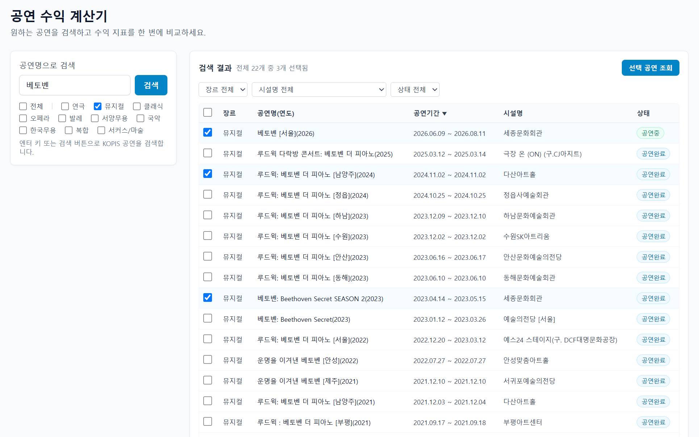
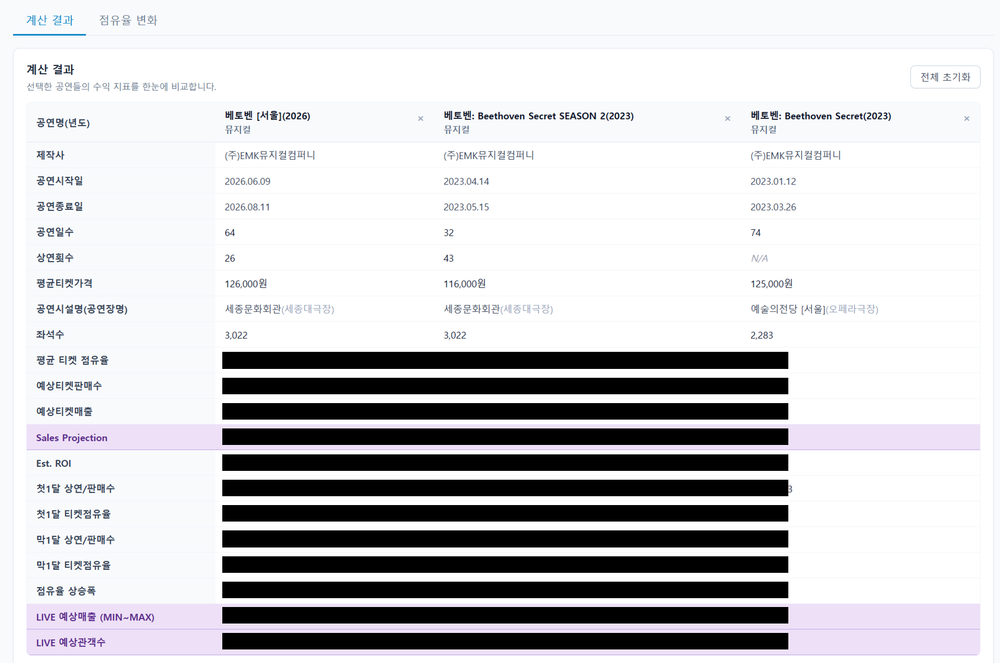
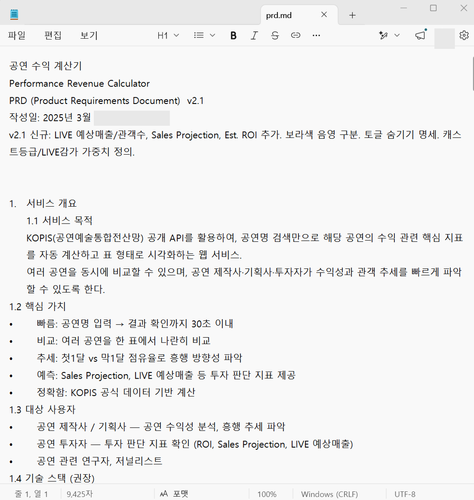
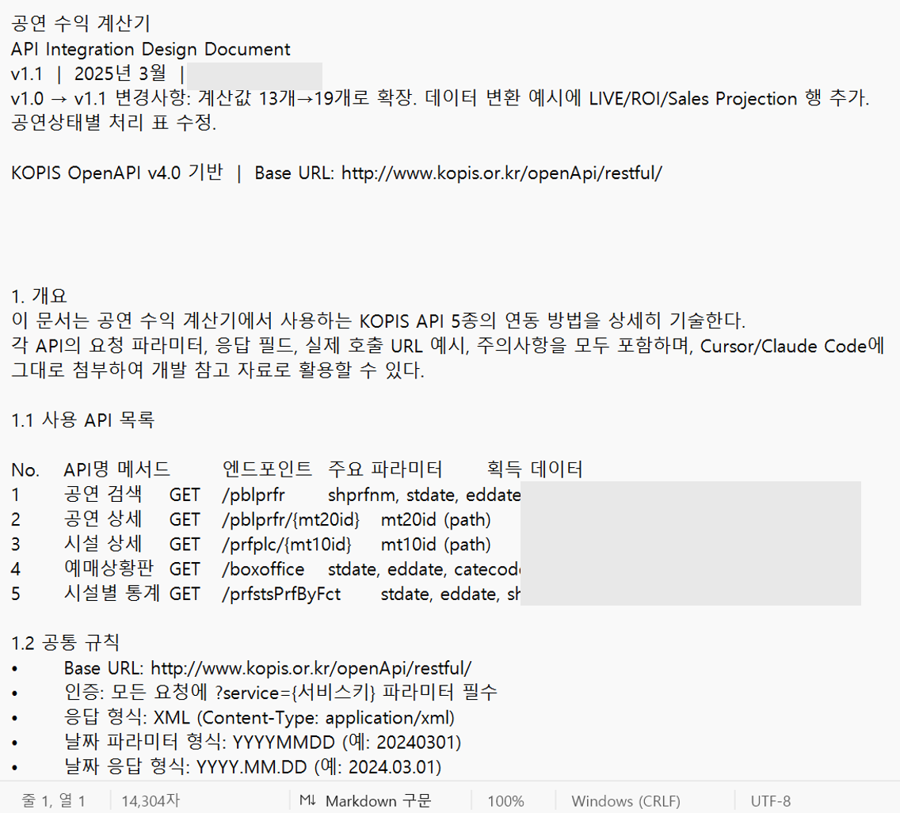

> 🔥 공연 판매 데이터, 이미 다 기록되고 있는데 왜 공개는 안되는지.. 그래서 OPEN API를 활용해 직접 계산기를 만들어 봤다. 물론 실제로는 여러 보정을 거쳐야 하기 때문에 아주 정확한 결과값은 아니지만, 궁금한 공연의 성적을 대략 확인해보는 용도로는 충분할 듯 하다.


## 왜 만들었나


어떤 공연이 잘 되는지 확인할 길이 없었다. 인터파크 순위나 KOPIS 예매상황판 만으로는 부족하다. 모든 공연장에 직접 가 볼 수도 없고, 이미 지난 공연들은 더더욱 확인이 힘들었다.

1. 관계자에게 직접 정확한 데이터를 확인하기 어렵고
2. KOPIS에서 공개하는 ‘순위’가 아닌 좀 더 정확한 데이터가 알고 싶었고
3. 이미 지나간 공연들의 과거 데이터를 확인하고 싶었다.


처음에는 KOPIS에서 데이터를 하나하나 확인했다. 여기 적어두고, 저기 적어두고, 크롬에 새창이 계속해서 쌓여갈 무렵… 이 KOPIS 데이터를 API로 가져올 수 있다면, 공연명만 넣으면 내가 원하는 데이터들을 자동으로 계산해주는 서비스를 만들 수 있지 않을까? 그게 이 프로젝트의 시작이었다.


## 어떤 서비스인가


KOPIS 공연수익계산기는 공연명을 검색하면 해당 공연의 수익 관련 21가지 지표를 자동으로 계산해서 표로 보여주는 서비스이다. 여러 공연을 동시에 선택해서 나란히 비교할 수 있도록 만들었다.





21가지 지표에는 단순 조회 항목도 있고, 내가 만든 규칙대로 계산해서 보여주는 항목들이 있다. 크게 나눠보면 공연의 (1)기본 정보, (2)판매실적, (3)흥행도를 파악할 수 있는 지표들이다.





### (1) 공연 기본 정보


기본 정보 항목들에는 공연명과 년도, 제작사명, 공연시작일과 종료일, 공연일수, 상연횟수, 평균티켓가격, 공연시설 정보가 있다.

- 공연일수는 공연시작일과 종료일을 기준으로 계산
- 평균티켓가격은 VIP, R, S, A석 등 판매한 티켓가격의 평균을 계산. (다만 좌석등급별로 데이터가 구분되어있지 않았기 때문에 데이터 양식을 보고 숫자를 파싱해서 평균값을 구했다. 각 좌석등급의 비율은 반영되지 않았다)

상연횟수를 구하는 것이 꽤나 까다로운 작업이었는데 이와 관련해서는 KOPIS 데이터 활용법에서 더 자세하게 다뤄보겠다. 표면적으로는 KOPIS에서 상연횟수를 호출할 수 없어서 따로 계산방법을 고안해 만들었다. 호출이 꽤나 많이 필요하지만 현재 상태에서 최선의 방법인 듯 하다.


### (2) 공연 판매실적(추정치)


두 번째는 공연 티켓이 얼마나 잘 팔렸는지에 대한 데이터이다.

- **평균 좌석점유율과 총 티켓 판매 수(추정)**: 상연횟수와 판매데이터를 기반으로 추정해서 계산
- **티켓매출(추정)**: 좌석 등급의 비율 정보는 KOPIS에서 확인할 수 없어서, 총 티켓 판매수에 점유율과 평균 티켓가격을 곱해 티켓매출을 추정했다. 티켓할인이 반영되지 않는다는 문제가 있는데, 개인적으로 몇 개 공연의 티켓 매출을 대략 확인해 봤을 때 정말 신기하게도 평균티켓가격에서 할인율이 어느 정도 반영되는 듯 보였다.
    - 티켓매출과 평균 티켓가격은 최근 KOPIS에서 나온 티켓할인율 관련 연구보고서에 따라 장르별 평균 티켓할인율을 적용해 보고 실제 데이터와 비교해봐도 재밌을 것 같다.
- **ROI(추정)**: 공연마다 BEP가 달라 ROI를 계산하는 것은 사실상 불가능했다. 하지만 대략적으로라도 판단할 수 있는 기준이 필요해 임의로 계산식을 만들어 보았다.
    - 처음에는 대략적인 대학로 공연 평균 BEP를 퍼센트로 계산해 넣었지만, 극장규모나 캐스팅, 초연 여부 등을 고려해서 점점 더 고도화하고 있다.
    - ROI는 제작비 데이터가 없는 한 정확하게 추정할 수 없다. 하지만 티켓 매출 대비, 어느 정도의 제작비가 적당한지 역으로 추산해볼 수는 있을 것이라 생각한다.
- **Sales Projection**:  이전 공연 실적들을 기반으로 성장세를 반영해 앞으로 얼마나 더 매출을 일으킬 수 있을지에 대한 계산식을 만들어 넣었다. 아직 고도화가 많이 필요한 지표라 여러 케이스를 보며 어떻게 예측을 하면 좋을지 데이터를 쌓는 중이다.

### (3) 작품 흥행도


마지막으로 작품 흥행도는 작품의 성장세를 계산하기 위해 직접 설계한 지표들이다. 가장 계산이 어려웠던 부분이기도 했다.


흥행도를 어떻게 측정할 수 있을지 고민이 많았는데, **(A)‘평균 좌석 점유율’이 높아야** 하는 것 뿐 아니라, **(B)작품이 상연되는 동안 좌석점유율이 갈수록 더 높아졌거나, 최소한 더 떨어지지 않아야** 한다고 생각했다. 그래서 <u>공연 기간 중의 첫 1달과 마지막 1달의 점유율을 파악해서 증감을 계산</u>하도록 했다. 공연 기간이 2달보다 짧은 경우에는 전체 공연 기간을 반으로 나눠 앞뒤의 증감을 계산하고 있다. (공연 기간이 2-3일로 매우 짧은 경우에는 비교가 무의미하긴 하다)


**점유율 상승폭**이 플러스면 입소문을 타 공연이 흥행했다는 것이고, 마이너스면 초반 기대감에 비해 지속력이 떨어졌다는 신호로 볼 수 있다. 실제로 대학로에서 ‘잘 됐다’라고 평가받는 작품들을 넣어보면 증감률이 +20%가 넘기도 한다. 증감률은 색상 조건부 서식을 적용해서 올랐는지 떨어졌는지 한 눈에 파악할 수 있도록 했다. 특히 증감률이 20%가 넘는 경우에는 하이라이트 표시도 추가했다.


**LIVE 예상매출**은 오아라이브 데이터를 합쳐서 ‘공연 1회 기준 유료 LIVE(온라인 공연) 최대/최소 예상 수익’을 계산한다. 기존 오아라이브의 라이브 데이터들과 공연실적의 상관관계를 기반으로 세팅했고, 계속해서 데이터를 쌓아가고 있는 항목이다.


## 어떻게 만들었나


### 1단계: 기획 & PRD 작성


어떤 지표를 보여줄지, 계산식은 무엇인지, API 연동 순서는 어떻게 되는지를 문서로 먼저 정리했다. API 문서를 뜯어보며 어떤 데이터를 가져올 수 있는지 파악했다. 바이브코딩을 해야하기 때문에, AI가 코딩에 들어가기 전에 PRD 초안을 최대한 꼼꼼하게 작성했고, 이후에 개발하면서 맞지 않는 부분들을 중심으로 업데이트했다.


기술 스택은 Next.js 15 + TypeScript + Tailwind CSS + Vercel 배포. KOPIS OPEN API v4.0을 활용했다. 내가 선택한 것은 아니고, 기획내용을 기반으로 클로드가 추천해 준 구성이다.





### 2단계: Mock 데이터로 UI 먼저 완성


실제 API를 붙이기 전에 가짜 데이터로 화면을 먼저 만들었다. 어떻게 보여야 하는지를 확정하고, 그다음에 데이터를 채우는 순서다. 특정 공연의 데이터를 예시로 잡아서, 실제 데이터가 들어갔을 때에 화면에서 어떻게 보이는지 예상할 수 있었고, 계산도 미리 한 번 해보면서 시행착오를 줄이기 위함이었다.


실제로 이 순서 덕분에 실제 API를 붙이면서 계산값이 바뀌어도 화면 자체를 수정해야 하는 번거로움을 줄일 수 있었다.


### 3단계: KOPIS API 실제 연동


KOPIS OPEN API는 7단계 순차 호출 구조로 설계했다. 공연 검색 → 공연 상세 → 시설 상세 → 예매상황판 → 전체기간 통계 → 첫1달 통계 → 마지막 1달 통계 순으로 호출하며, 각 단계에서 다음 단계에 필요한 ID와 데이터를 얻는다. 이 과정에서 시행착오가 가장 많았다. 문서에 없는 제약사항이 계속 나왔고, 실제 응답 구조가 문서와 다른 경우도 여러 건이었다.


API Design 문서를 미리 정리해둔 것이 큰 도움이 되었다. 실제로 API연동 후에 업데이트가 필요한 부분들은 이후에 반영하면서 문서를 최신화 하고 있다.





### 4단계: 검증 & 배포


계산 결과를 KOPIS 공식 웹사이트 수치와 직접 비교했다. 수치가 맞아야 의미 있는 서비스이니 이 검증 과정이 필수였다. Vercel로 배포했고, 이 과정에서도 예상치 못한 시행착오가 여러 건 있었다.


## 쉽지 않았던 과정…


API 문서를 클로드에게 통째로 주면 알아서 잘 구현할 거라 생각했다. 오산이었다. 게다가 KOPIS OPEN API는 웹에서 직접 호출이 불가했기 때문에 AI가 스스로 작업할 수 없었다.


계산 결과가 틀렸을 때 어느 단계에서 문제가 생겼는지 파악하려면 데이터 구조를 어느 정도는 알아야 했다. 계산기에 나온 결과와 실제 KOPIS 웹사이트에서 검색한 데이터를 대조해가면서 데이터 정합성을 체크하기도 했다. AI가 구현하더라도 설계는 내 몫이었다. 어떤 데이터를 어떻게 쓸지, 계산식이 무엇인지, 예외 케이스는 어떻게 처리할지 — 이걸 정확히 정의할수록 AI가 더 잘 구현해줬다.


총 작업 기간은 5일 정도 걸렸다. 하루에 3-4시간 씩 작업했으니, 주말에 맘 먹고 만들었으면 2-3일 만에 완성했을 수도 있겠지만… 클로드 일일 사용한도 제한 때문에 또 어려웠을 수 있겠다는 생각이…..


다음 편에는 KOPIS API 데이터를 활용하며 겪은 시행착오들을 좀 더 자세히 정리해보겠다.


```toc
```
