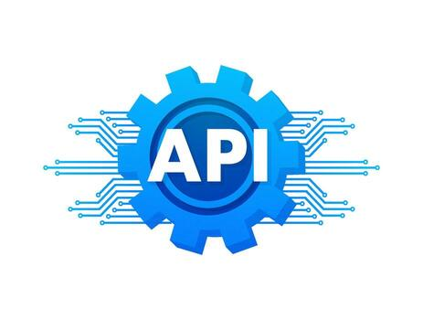
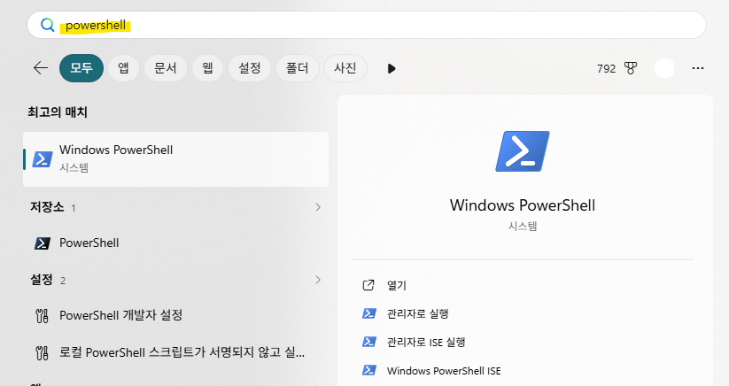
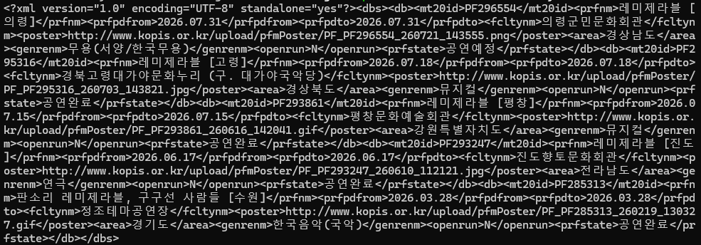
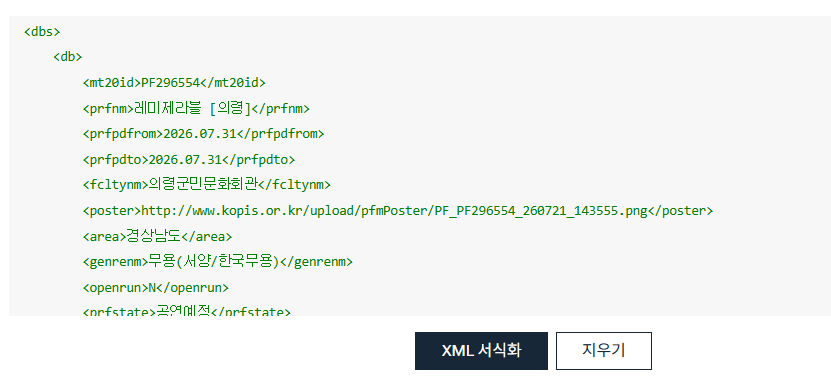

예술인, 또는 문화예술 분야에 있는 기획자라면 KOPIS 데이터를 ‘한 번쯤 써봐야지’ 하는 생각을 해 본 적이 있을 것이다. 하지만 홈페이지에서 검색해보는 것 말고는 어떻게 더 잘 사용해볼 수 있는지는 잘 모르는 경우가 더 많을 것 같다. (나도 그랬으니까ㅠㅠ)


KOPIS 데이터를 활용해 뭔가 해볼 수 있지 않을까? 하는 아이디어는 있었지만, 어디서부터 어떻게 시작해야할지 전혀 몰랐다. 그래서 나처럼 코드가 낯설지만 공연 데이터를 활용해보고 싶은 기획자와 예술인들을 위해 내가 부딪힌 기록을 남겨본다.





## KOPIS Open API란 무엇인가?


먼저 KOPIS가 뭔지부터. 공연예술통합전산망, 줄여서 KOPIS는 한국의 모든 공연 정보를 모아둔 공공 데이터베이스다. 뮤지컬, 연극, 콘서트, 클래식, 무용… 장르를 가리지 않는다. 일정과 시설, 예매 현황과 통계까지 담는다. 인터파크든 예스24든, 예매처에서 일어난 일은 결국 이곳으로 흘러든다. 전국 공연의 흐름을 한자리에서 볼 수 있다는 뜻이다.


그리고 이 데이터를 KOPIS는 Open API로 열어둔다. 무료다. 신청하고 승인만 나면, 'API 키(서비스키)' 하나로 공연 데이터를 직접 꺼내 쓸 수 있다.


> 💡 **'API'라는 말부터 막힌다면**  
> API는 "데이터를 요청하는 창구"쯤으로 생각하면 된다. (완전히 이해하려고 하지 말자..)  
>   
> 검색창에 키워드를 넣고 결과를 받아보는 것과 크게 다르지 않다. 다만 사람이 화면으로 보는 대신, 정해진 주소(URL)로 요청을 보내면 데이터가 텍스트(XML)로 돌아온다. '엑셀 다운로드' 버튼은 없다. 대신 내가 주소를 만들어 호출한다. 그 차이뿐이다.


**1편(이 글)**에서는 서비스키를 받고, 실제 데이터를 내 눈으로 확인하는 것까지의 내용을 다루고, 여러 API를 엮어 쓰는 실전 분석과 자주 걸리는 함정은 **2편**에서 정리해보겠다.


<br>


## 1단계: 서비스키(API Key) 받기


서비스키(API Key)는 일종의 출입증이다. 뭔지 더 알려고 하지 말자22… (나도 잘 모름) 어쨌든 OPEN API를 활용하려면 출입증이 필요하다. 과도한 무단 사용을 막고, 누가 사용했는지 파악하기 위한 그런 장치이다.


KOPIS 공식 사이트([www.kopis.or.kr](http://www.kopis.or.kr/))에 들어가 상단 메뉴의 **공개 API** 섹션으로 간다. 회원가입하고 로그인하면 신청 화면이 나온다. 사용 목적과 서비스 설명을 적으라고 하는데, 겁먹을 것 없다. 승인은 빠르게 처리된다.


받은 서비스키는 함부로 노출하면 안 된다고 한다. AI에게도 직접 서비스키를 보내지 말아야 한다. (클로드가 보내지 말라고 직접 이야기할 정도) 서비스키는 환경변수에 넣어두면 된다. 클로드가 만들어주는 파일에 내 서비스키만 수정해서 저장해두면 된다.


> 🤖 **서비스키(API Key)를 노출하면 안 되는 이유**  
> 이걸로 뭐 대단한 걸 하는 것도 아닌데 누가 내 키에 접근할 수 있다고 해서 무슨 문제가 생길쏘냐 싶었지만… 서비스키를 노출하는 것은 마치 카카오톡 상태메세지에 주민등록번호나 법인카드 정보를 메모해놓는 것과 같은 느낌이다.  
>   
> 상태메세지에 법인카드 정보를 메모해두는 것 자체만으로 문제가 생기는 것은 아니지만 누군가 그 법인카드 정보를 활용해 몰래 결제를 할 수도 있으니까. 주민등록번호를 메모해둔다고 그걸로 뭘 할 수 있냐 싶지만 내 신분을 도용해 범죄를 저지를 수도 있으니까 하지 않는 것처럼.  
>   
> KOPIS API는 과금이 되지 않아서 괜찮지만, 보통 API들은 호출 수에 따라 과금을 하기 때문에, 내 API 서비스키를 활용해 마음대로 활용한다면 내 계정으로 비용이 청구될 수 있다. 또 API호출을 대량으로 발생시키면 서버가 느려지는 등 내 서비스에 문제가 생길 수도 있다.


<br>


## 2단계: 이해는 안 되겠지만 들어만 두세요


서비스키를 받았다고 바로 뭔가 뚝딱 만들 필요는 없다. 다만 아래 네 가지만 알아두면, 다음 단계에서 응답을 봤을 때 당황하지 않는다.


**주소는 하나로 통일된다.** 모든 요청은 `http://www.kopis.or.kr/openApi/restful/` 로 시작한다. 그 뒤에 원하는 엔드포인트(데이터의 이름표)를 붙이면 끝.


**서비스키(API Key)는 항상 붙인다.** 빠짐없이 `?service=서비스키` 를 넣어야 한다.


**응답은 JSON이 아니라 XML이다.** 이걸 모르고 시작하면 첫 응답에서 당황한다. 결과가 `<dbs><db>...</db></dbs>` 같은 태그 뭉치로 온다. 처음엔 "이게 뭔가" 싶어도, 다음 단계에서 직접 보면 감이 잡힌다.


**브라우저 직접 호출은 안 된다.** 웹페이지 코드에서 KOPIS API를 직접 호출하면 보안 정책(CORS)에 걸려 거부당하는 경우가 있다. 지금 단계에서는 정확히 이게 무슨 말인지 알 수 없는 게 당연하다. 문제가 되는 상황은 클로드같은 ai에서 바로 실행을 요청하는 경우이다. ai가 직접 api를 호출할 수는 없도록 되어 있다. 이 문제는 cmd나 파워쉘을 사용하면 전혀 문제는 없고, ai와 작업할 때에도 어떻게 우회해서 작업하면 되는지 알려줄 것이기 때문에 미리 걱정할 필요는 없다.


<br>


## 3단계: 어떻게 되는 건지, 응답을 확인해보자


본격적으로 개발에 들어가기 전에, 실제 응답이 어떻게 생겼는지부터 직접 봐야 한다. 기본적인 이해도를 높일 수 있고, 또 문서에 적힌 필드와 진짜 응답이 어긋나는 경우가 의외로 많기 때문이기도 하다.


### 응답을 눈으로 확인해보는 3가지 방법


**방법 1 - 브라우저 주소창.** 인터넷 창을 열고, 아래 주소에서 `서비스키`만 본인 키로 바꿔 주소창에 붙여 넣어보자. 응답 XML이 곧장 뜬다.


```javascript
http://www.kopis.or.kr/openApi/restful/pblprfr?service=서비스키&stdate=20250301&eddate=20250331&cpage=1&rows=10
```


**방법 2 - PowerShell(윈도우).** 응답을 텍스트로 받아 메모장에 붙이고 Ctrl+F로 필드를 찾아보면 구조가 빠르게 잡힌다.


```javascript
response = Invoke-WebRequest -UseBasicParsing "<http://www.kopis.or.kr/openApi/restful/pblprfr?service=
서비스키
&stdate=20260101&eddate=20261231&shprfnm=([uri]::EscapeDataString('레미제라블')>)&cpage=1&rows=10"
[System.Text.Encoding]::UTF8.GetString($response.RawContentStream.ToArray())
```


> 💡 윈도우에 powershell은 기본으로 설치되어 있을 확률 200%  
> 


**방법 3 - 터미널(Mac).** Mac에 터미널(zsh)은 기본 설치되어 있다. 


```javascript
curl -G "
http://www.kopis.or.kr/openApi/restful/pblprfr
" \
--data-urlencode "service=API키" \
--data-urlencode "stdate=20260101" \
--data-urlencode "eddate=20261231" \
--data-urlencode "shprfnm=레미제라블" \
--data-urlencode "cpage=1" \
--data-urlencode "rows=10"
```


파일로 저장하려면 맨 뒤에 `-o result.xml`만 붙이면 된다.


아래는 출력 예시.



*이렇게 출력되는 게 바로 xml… 우리는 알아보기 힘들지만 컴퓨터는 잘 알아듣는다!*


정리된 내용을 보고 싶다면, 구글에 ‘XML 포맷터(Formatter)’ 또는 ‘XML 정리’ 라고 검색하면 여러가지 무료 솔루션이 나온다. 여기에 그대로 복사-붙여넣기 하면, 아래처럼 정리가 된다.





<br>


### 출력을 확인해봐야 하는 이유


API 문서는 공식을 정리해 둔 참고서처럼 활용해야 한다. 공식을 읽어본다고 해도 예제를 풀어보고 숫자를 대입해보지 않으면 실제로 어떻게 활용할 수 있는지 제대로 알 수 없다.


실제 응답이 어떻게 출력되는지 확인해보고 설계하면 훨씬 빠르고, 나중에 어떤 오류가 발생했을 때에도 훨씬 빠르게 대처할 수 있다. 문서에 적힌 내용과 진짜 응답이 다른 경우도 의외로 많기 때문에, 본격 작업 전에 응답을 미리 확인해보면 많은 도움이 된다. 초보자일수록 더더욱!


<br>


## 4단계: 자주 쓰게 되는 핵심 엔드포인트 4가지


전체 목록을 다 외울 필요는 없다. 시작 단계에서는 아래 네 개만 알아도 웬만한 건 다 해결된다.


> 🤖 **엔드포인트란, API의 URL주소 같은 것!**  
> 예를들어  
>  [naver.com](http://naver.com/) → 네이버 홈페이지  
>  [naver.com/mail](http://naver.com/mail) → 네이버 메일  
>  [naver.com/cafe](http://naver.com/cafe) → 네이버 카페  
>   
> 이런 식으로 맨 뒤에 요청별로 다른 엔드포인트를 붙인다.


| 무엇을 알고 싶을 때    | 엔드포인트            | 핵심 결과                                 |
| -------------- | ---------------- | ------------------------------------- |
| 공연 목록을 검색      | `pblprfr`        | 공연 ID(`mt20id`), 공연명, 장르, 기간, 상태, 포스터 |
| 특정 공연의 상세 정보   | `pblprfr/{공연ID}` | 출연진, 제작진, 런타임, 티켓가격, 시설ID(`mt10id`)   |
| 특정 공연장의 상세 정보  | `prfplc/{시설ID}`  | 객석 수, 개별 공연장별 좌석규모, 주소                |
| 날짜별 예매 순위(상황판) | `boxoffice`      | 공연별 순위, 좌석수, 상연횟수                     |


### 💡 **어디서부터 봐야 할지 모르겠다면?**


거의 모든 분석은 한 곳에서 출발한다. `pblprfr`, 공연 검색이다. 여기서 얻는 공연 ID(`mt20id`)가 이후 상세조회와 통계조회의 열쇠가 되기 때문이다.


예를 들어 "공연A가 얼마나 잘 됐나"를 보고 싶다고 치자. 공연A를 찾아 ID를 확인하고 → 그 ID를 가진 공연의 상세정보를 조회하거나, 예매현황판을 조회하는 것이다.


축제 목록, 수상작, 기획·제작사 정보, 장르·기간·지역별 통계 지표 등 KOPIS가 제공하는 나머지 엔드포인트 전체 목록과 코드값 표는 2편 앞부분에 정리해 두었다.


<br>


## 1편을 마치며


여기까지 왔다면, 서비스키도 받았고 실제 데이터가 어떻게 생겼는지도 눈으로 확인했다. 이미 절반은 넘었다.


핵심만 다시 정리하면 이렇다. **서비스키로 출입증을 받고, 먼저 눈으로 확인하고, 공연 검색(****`pblprfr`****)에서 얻은 ID를 열쇠 삼아 필요한 데이터를 찾아간다.** 이 흐름만 알고 있으면, 나머지는 응용이다. 그리고 우리는 코드를 직접 짜서 입력하지 않고, AI에게 도움을 요청할 것이기 때문에!


2편에서는 이 열쇠(ID)를 실제로 여러 API에 넘겨가며 "공연 실적을 계산"하는 실전 흐름과, 그 과정에서 겪은 다른 시행착오들과 KOPIS API를 활용할 때에 주의해야 할 점들을 정리한다.


<br>


---


_참고: KOPIS OPEN API 개발가이드 v4.0 / 공통코드 문서 기준. 엔드포인트와 코드값은 버전에 따라 바뀔 수 있으니 공식 문서를 함께 확인하세요._


<br>


```toc
```
