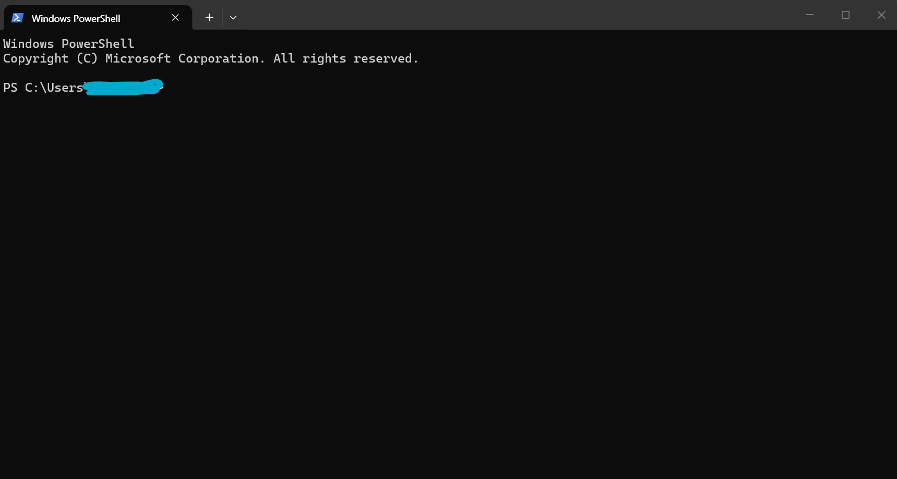
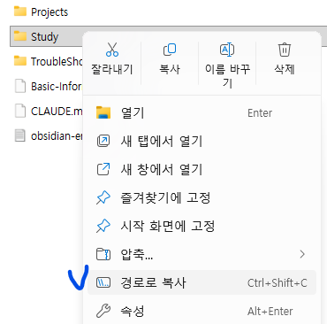
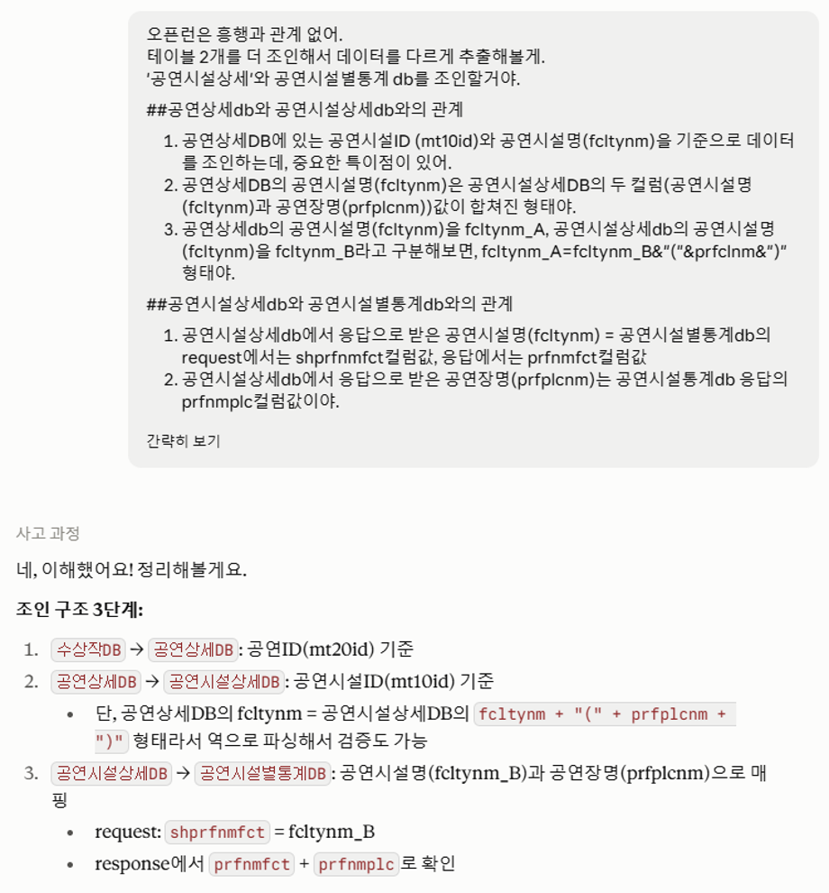

## 1편 다시, 짧게


1편에서 서비스키를 받았고, 브라우저나 파워쉘로 실제 응답도 눈으로 봤다. 이제 그다음이다. KOPIS가 가진 공연티켓데이터를 전체적으로 펼쳐보고, 그 데이터를 AI에게 코드로 부탁해서 뽑아내는 법까지 정리한다.


<br>


## 1. 전체 데이터 파악하기 - 어떤 데이터를 가져올 수 있나


KOPIS가 열어둔 데이터는 크게 셋으로 나뉜다. 공연 정보, 공연시설 정보, 그리고 예매·통계 숫자.


1편에서 맛본 네 개 외에, 전체 목록은 아래와 같다. 외우지 않아도 되지만, 어떤 데이터들이 있는지 살펴는 보자.


주소는 전부 `http://www.kopis.or.kr/openApi/restful/` 뒤에 아래 엔드포인트를 붙이면 된다.


### ① 공연·작품 정보 데이터


| 무엇을 알고 싶을 때  | 엔드포인트            | 핵심 결과                                     |
| ------------ | ---------------- | ----------------------------------------- |
| 공연 목록을 검색    | `pblprfr`        | 공연 ID(`mt20id`), 공연명, 장르, 기간, 상태, 포스터     |
| 특정 공연의 상세 정보 | `pblprfr/{공연ID}` | 출연진, 제작진, 런타임, 관람연령, 티켓가격, 시설ID(`mt10id`) |
| 수상작 목록       | `prfawad`        | 공연 정보 + 수상실적                              |
| 축제 목록        | `prffest`        | 축제로 분류된 공연 목록                             |
| 작가·창작자 정보    | `prfper`         | 원작자, 창작자 정보                               |


### ② 공연시설·기관 정보 데이터


| 무엇을 알고 싶을 때   | 엔드포인트           | 핵심 결과                           |
| ------------- | --------------- | ------------------------------- |
| 공연장 목록 검색     | `prfplc`        | 시설 ID(`mt10id`), 시설명, 공연장 수, 지역 |
| 특정 공연장의 상세 정보 | `prfplc/{시설ID}` | 객석 수, 개별 공연장별 좌석규모, 주소, 편의시설    |
| 기획·제작사 목록     | `mnfct`         | 제작사 ID, 제작사명, 장르, 최신작품          |


### ③ 예매·통계 데이터


| 무엇을 알고 싶을 때    | 엔드포인트            | 핵심 결과                |
| -------------- | ---------------- | -------------------- |
| 날짜별 예매 순위(상황판) | `boxoffice`      | 공연별 순위, 좌석수, 상연횟수    |
| 기간별 예매통계(일/주별) | `boxStats`       | 예매수, 취소수, 판매수, 판매액   |
| 장르별 예매통계       | `boxStatsCate`   | 장르별 공연건수·판매수·판매액     |
| 시간대별 예매통계      | `boxStatsTime`   | 시간대별 예매·판매 현황        |
| 가격대별 예매통계      | `boxStatsPrice`  | 가격대별 판매수·비중          |
| 기간별 공연통계       | `prfstsTotal`    | 일/요일/월별 관객수·매출액      |
| 지역별 공연통계       | `prfstsArea`     | 지역별 시설수·좌석수·판매액      |
| 장르별 공연통계       | `prfstsCate`     | 장르별 매출·관객 점유율        |
| 공연별 통계         | `prfstsPrfBy`    | 공연별 상연횟수·시작일·시설      |
| 공연시설별 통계       | `prfstsPrfByFct` | 시설·공연장별 좌석수·상연횟수·판매수 |
| 가격대별 통계        | `prfstsPrice`    | 가격대별 예매수·예매액 비중      |


## 2. AI를 활용할 계획인 우리에게 제약이 되는 CORS


> 💡 **CORS(Cross-Origin Resource Sharing, 교차 출처 리소스 공유)란?**   
> 브라우저는 원래 기본적으로 다른 출처(도메인)의 데이터는 가져오지 못하는 ‘동일 출처 정책(Same-Origin Policy)를 가지고 있다. <u>CORS는 그 규칙에 예외를 허용해주는 보안 정책이자 규칙</u>.  
>   
> **KOPIS는 CORS를 허용하지 않음. 그래서 내가 다른 브라우저에서 API를 직접 호출하는 것을 허용하지 않는다. 사람이 직접 터미널에서 요청하는 것은 가능하지만, AI가 직접 데이터를 가져올 수는 없는 것이다.**  
>   
> 마치 남이 우리 집 냉장고를 열어서 마음대로 뭔가 꺼내가면 안 되는 것 처럼, 웹사이트도 낯선 서버가 데이터를 마음대로 가져가지 않도록 정해둔 규칙이라고 볼 수 있다.


### 코드값과 CORS, 몰라도 되는 이유


장르, 지역, 공연상태… 이런 세부 코드값도 물론 존재한다. 다만 외울 필요는 없다. "장르는 뮤지컬로, 지역은 서울로 걸러줘"라고 말로 던지면, 코드값을 찾아 넣는 건 AI 몫이다. 내가 알아야 할 건 코드 자체가 아니라, 그런 코드가 존재한다는 사실 정도면 충분하다.


CORS도 마찬가지다. 원리까지 이해할 필요는 없다. 다만 이거 하나는 기억해두자. 브라우저든 AI든, 이 API를 직접 부르지는 못한다는 것. AI에게 "지금 바로 이 API 호출해봐"라고 시켜도 안 되는 이유가 여기 있다.


그래서 방식이 이렇게 된다. AI에게 데이터를 직접 달라고 하는 게 아니라, 데이터를 뽑아 저장하는 **코드**를 부탁하고… 그 코드는 내가 터미널에서 직접 실행한다. 다음 챕터에서 이 과정을 처음부터 끝까지 그대로 따라가 본다.


<br>


## 3. 터미널을 열고, API 호출해서 데이터 뽑아내기까지


1편에서는 딱 한 번, 응답이 어떻게 생겼는지 눈으로 확인하는 테스트만 했다. 여기서부터는 다르다. 실제로 원하는 데이터를 뽑아서 파일로 저장하는, 진짜 작업이다. 순서대로 따라오면 된다.


### 1단계: 터미널 열기


1편에서 이미 한 번 열어봤다. Windows라면 시작 메뉴에서 'PowerShell'을 검색해 실행하고, Mac이라면 Spotlight(Cmd+Space)에서 '터미널'을 검색해 실행한다. 검은(혹은 파란) 화면에 커서만 깜빡이고 있다면 제대로 연 것이다.





<br>


### 2단계: 작업 폴더로 이동하기


아무 데나 파일을 저장하면 나중에 찾기 힘들다. 원하는 곳에 작업폴더를 만들고 이동한다.


예를 들어 바탕화면에 `kopis`라는 이름으로 폴더를 하나 미리 만들었다면, 터미널에 아래처럼 명령어를 입력해서 그 폴더로 이동한다.


```powershell
cd Desktop\kopis
```


Mac이라면 `cd Desktop/kopis`. "이런 파일이나 디렉터리가 없습니다" 같은 오류가 뜬다면, 폴더를 아직 안 만든 것이다. 탐색기(파인더)에서 먼저 폴더를 만들고 다시 시도하자.


> 💡 내 작업폴더 경로가 뭔지 모르겠다면! **작업폴더에서 마우스 우클릭**하고 <u>‘경로로 복사’</u>를 선택하면 된다.  
> “cd”가 폴더로 이동하는 명령어이므로, “cd”를 입력한 후 붙여넣기 하면 끝!  
>   
> 참고로 한 단계 뒤로 폴더 이동할 때에는 “cd ..” 라고 입력하면 된다. 점 두 개!  
>   
> 


<br>


### 3단계: 파이썬이 준비돼 있는지 확인하기


데이터를 뽑는 코드는 파이썬으로 받을 거다. 그러니 실행할 파이썬이 깔려 있어야 한다. 터미널에 아래처럼 입력해보자. (여러 방법이 있지만, 나에게는 이 방법이 제일 쉬웠다. 파이썬을 몰라도 된다! 어짜피 클로드가 알아서 해준다.)


```powershell
python --version
```


`Python 3.12.4`처럼 버전 숫자가 찍히면 준비 끝이다. "python은(는) 내부 또는 외부 명령이 아닙니다" 같은 오류가 뜬다면 아직 없는 것이니 [python.org](http://python.org/)에서 설치한다.


> ⚠️ Windows에서 파이썬을 설치할 때, 설치 첫 화면 아래쪽의 **'Add Python to PATH'** 체크박스를 반드시 켜야 한다. 이걸 놓치면 설치를 마치고도 터미널에서 계속 "명령이 아닙니다" 오류가 뜬다. 초보자가 가장 많이 걸리는 지점이다.


파이썬이 확인됐다면, 도구 두 개를 설치한다. 처음 한 번만 하면 된다. 아래 명령어를 그대로 복붙하면 된다.


```powershell
pip install requests openpyxl
```


`requests`는 API를 호출해오는 도구, `openpyxl`은 결과를 엑셀로 저장하는 도구다.


<br>


### 4단계: AI에게 '코드'를 요청하기


여기서 중요한 걸 짚고 가야 한다. 클로드 같은 AI는 KOPIS API를 직접 호출하지 못한다. 위에 2번에서 언급한 CORS규칙 때문이다. 그러니 "이 데이터 뽑아줘"라고 말해도, AI가 알아서 데이터를 쥐어주지는 않는다. 


AI가 해줄 수 있는 건 데이터를 뽑아서 저장하는 코드를 짜주는 것까지고, 그 코드를 실행하는 건 내 몫이다. 그래서 프롬프트는 '데이터를 달라'가 아니라 '코드를 짜달라'는 요청이어야 한다.


이때 요청에 아래 세 가지를 꼭 넣자. 나중이 편해진다.

1. **파이썬 스크립트로, 작업 폴더에 .py 파일로 저장해달라** — 코드를 채팅창에서 복사해 옮기는 과정이 통째로 사라진다. 파이썬을 설치한 이유!
2. **결과는 엑셀 파일로 저장해달라** — XML 원본은 사람이 읽기 어렵다. 엑셀로 받으면 바로 정렬하고 걸러볼 수 있다.
3. **파일명 뒤에 실행 날짜와 시간을 붙여달라** — 한 번에 원하는 결과를 얻기 쉽지 않다. 분명 여러번 추출하게 될텐데, 이 규칙이 없으면 다시 실행할때마다 앞의 결과 파일이 덮어 씌워진다.
더 심각한 문제는, 내가 엑셀파일을 열어둔 상태에서 스크립트가 모두 돌아가면… 최종 저장 단계에서 오류가 발생하고(파이썬이 작업해야하는 파일이 열려있으니까), 그러면 스크립트가 실패하면서 처음부터 다시 데이터를 추출해야 한다. 시간이 적게 걸리는 건 괜찮지만 2-3시간 기다려야 하는 추출 작업을 몇 차례 실패한 적이 있는 내 경험에서 나온… 팁이다ㅠㅠ

정리하면 이런 프롬프트가 된다.


> 💬 "`pblprfr`을 호출해서 2026년 8월 한 달 동안 서울에서 하는 뮤지컬 목록을 가져오는 파이썬 스크립트를 짜서, 지금 작업 폴더에 `get_musical.py`로 저장해줘. 서비스키는 내가 나중에 채워 넣을 수 있게 맨 위에 변수로 빼두고, 결과는 엑셀 파일로 저장하되 파일명 뒤에 실행 날짜와 시간을 붙여서 다시 실행해도 이전 결과가 지워지지 않게 해줘."


이렇게 요청하면, AI는 대략 이런 스크립트를 만들어준다.


```python
import requests
import xml.etree.ElementTree as ET
import openpyxl
from datetime import datetime

# 서비스키만 아래에 채워넣으세요
SERVICE_KEY = "여기에_내_서비스키"

url = "http://www.kopis.or.kr/openApi/restful/pblprfr"
params = {
    "service": SERVICE_KEY,
    "stdate": "20260801",   # 조회 시작일
    "eddate": "20260831",   # 조회 종료일
    "signgucode": "11",     # 지역: 서울
    "shcate": "GGGA",       # 장르: 뮤지컬
    "cpage": 1,
    "rows": 100,
}

res = requests.get(url, params=params, timeout=15)
items = ET.fromstring(res.content).findall(".//db")
print(f"조회된 공연: {len(items)}건")

# 결과를 엑셀로 정리
wb = openpyxl.Workbook()
ws = wb.active
ws.title = "공연목록"
ws.append(["공연ID", "공연명", "시작일", "종료일", "공연장", "상태"])

for item in items:
    ws.append([
        item.findtext("mt20id"),
        item.findtext("prfnm"),
        item.findtext("prfpdfrom"),
        item.findtext("prfpdto"),
        item.findtext("fcltynm"),
        item.findtext("prfstate"),
    ])

# 파일명 뒤에 실행 시각을 붙여 덮어쓰기를 막는다
timestamp = datetime.now().strftime("%Y%m%d_%H%M%S")
output_path = f"result_musical_{timestamp}.xlsx"
wb.save(output_path)

print(f"완료. {output_path} 파일을 확인하세요.")
```


> 💡 클로드 코드처럼 내 폴더에 직접 파일을 만들어주는 도구를 쓰고 있다면 여기서 끝이다. 웹 브라우저의 챗 화면만 쓰고 있다면, 코드를 복사해 메모장(Windows)이나 텍스트 편집기(Mac)에 붙여넣고 작업 폴더에 저장한다. 이때 "파일 형식"을 "모든 파일"로 바꾸고 파일명을 `get_musical.py`처럼 확장자까지 직접 써야 한다. 그냥 저장하면 `get_musical.py.txt`가 돼서 실행이 안 된다.


> 💡 저장 규칙은 프로젝트의 기본 가이드로 저장해둬도 좋다. 나는 [guide.md](http://guide.md/) 파일로 만들어서 관리하고, 새로운 규칙이 생길 때에 이 가이드를 업데이트하고 있다.


<br>


### 5단계: 스크립트 실행하기


파일이 있는 폴더로 이동한 상태(2단계에서 이미 이동해뒀다)에서, 아래처럼 실행한다.


```powershell
python get_musical.py
```


`조회된 공연: 100건` 같은 문장이 뜨고 마지막에 저장 완료 메시지가 나오면 성공이다. 자주 걸리는 오류는 세 가지 정도다.


> ⚠️ **`ModuleNotFoundError: No module named 'requests'`** → 3단계의 `pip install requests openpyxl`을 건너뛴 것이다. 그 줄을 먼저 실행하고 다시 시도한다.  
> **`python은(는) 내부 또는 외부 명령이 아닙니다`** → 파이썬이 없거나 'Add Python to PATH'를 놓친 경우다. 3단계로 돌아간다.  
>   
> **FileNotFoundError 또는 "지정된 파일을 찾을 수 없습니다"** → 지금 터미널이 있는 위치와 파일을 저장한 폴더가 다르다. `dir`(Mac은 `ls`)로 파일이 보이는지 확인하고, 안 보이면 `cd`로 올바른 폴더로 이동한다.  
>   
> 어떤 오류든, 화면에 뜬 메시지를 통째로 복사해 AI에게 붙여넣으면 된다. 혼자 해석하려 애쓰지 않아도 된다.


<br>


### 6단계: 결과 확인하기


스크립트가 잘 실행되면 작업 폴더 안에 `result_musical_20260828_143052.xlsx` 같은 파일이 새로 생긴다. 뒤에 붙은 숫자가 실행한 날짜와 시각이다. 더블클릭해서 열어보면 공연 목록이 표로 정리돼 있다.


조건을 바꿔 다시 실행하면 앞의 파일은 그대로 두고 새 파일이 하나 더 생긴다. 8월치와 9월치를 나란히 놓고 비교하거나, 잘못 뽑은 것 같을 때 이전 결과로 되돌아가는 게 이래서 가능해진다. 파일이 쌓이는 게 지저분해 보일 수도 있지만, 덮어써서 날려먹는 쪽이 훨씬 비싸다.


엑셀이 비어 있거나 오류 메시지만 담겨 있다면, 터미널에 찍힌 내용을 그대로 AI에게 보여주면 된다. 어디가 잘못됐는지 짚어준다.


<br>


### 데이터 구조를 파악하고 있으면 좋은점
: 클로드가 헤맬 때 먼저 알아채고 빠른 단도리가 가능하다



*데이터 구조를 대략 알고 있어야 가능한 대화*


클로드가 기본 가이드는 잘 파악하겠지만, 세세한 특성까지 모두 파악하고 나서 방법을 알려주는 것이 아니기 때문에 가끔은 엉뚱하게 방향을 잡을 때도 있다. 물론 그 방향으로 가도 언젠가 원하는 결과에 닿겠지만, 내가 지름길을 알고 있다면 굳이 클로드와 소모적인 시간을 보낼 필요는 없다.


데이터 구조를 파악하고 있으면, 클로드가 헤매고 있을 때에 직접적인 정보를 주거나 가이드를 줌으로써 잘못된 방향을 빠르게 바로잡을 수 있다. AI는 대체로 복잡하고 많은 단계를 거쳤을 때에 과부하가 와서 잘못된 대답을 하거나 단계가 꼬이는 상황이 발생하기 쉬우므로, 내 시간을 아끼기 위해서라도 데이터 구조를 대략 알아두면 많은 도움이 된다.


<br>


<br>


## 프롬프트 템플릿, 쉬운 것부터 복잡한 것까지


방금 해본 것처럼, 여기서 모든 요청은 결국 'AI에게 코드를 짜달라는 것'이다. 난이도는 참조하는 엔드포인트 개수로 나뉜다.


### 참조 엔드포인트 1개 — 방금 해본 것


위 4단계에서 쓴 프롬프트가 바로 이 유형이다. 엔드포인트 하나, 조건 몇 개만 정하면 스크립트 하나로 끝난다.


### 참조 엔드포인트 2개 — 스크립트를 두 번 나눠 요청


> 💬 1차: "`pblprfr`로 '레미제라블'을 검색해서 공연ID와 시설ID를 결과로 보여주는 스크립트 짜줘."  
> → 실행해서 나온 시설ID를 확인한다.  
>   
> 2차: "방금 확인한 시설ID ○○○으로 `prfplc/{시설ID}`를 호출해서 좌석수를 가져오는 스크립트도 짜줘."  
>   
> → 실행해서 좌석수까지 확인한다.


한 번에 몰아서 요청하지 않는다. 스크립트를 실행해서 결과를 눈으로 확인한 다음, 그 결과값(ID 등)을 다음 요청에 그대로 넣어주는 식이다. 이렇게 나눠 가는 편이 훨씬 안전하다.


### 참조 엔드포인트 3개 이상 — 여기부터는 3편에서


공연 하나의 실적을, 그러니까 상연횟수와 관객수, 점유율까지 계산하려면 세 개, 네 개의 엔드포인트를 순서대로 엮어야 한다. 여기서부터는 스크립트 하나로 안 끝나고, 단계별로 나눠 실행 → 확인 → 다음 요청을 반복해야 하는 영역이다. 이 실전 흐름은 3편에서 사례로 통째로 다룬다.


<br>


## 2편을 마치며


지도는 다 봤다. 코드값과 CORS는 몰라도 되는 이유도 확인했고, 터미널을 열어 AI가 짜준 코드를 실행하고 결과를 저장하는 것까지 직접 손으로 해봤다. 이제 남은 건 하나뿐이다. 이 흐름을 진짜 분석에 써먹는 것.


3편에서는 이 흐름을 실전 사례로 통째로 따라가 보고, 그 과정에서 초보자가 가장 흔히 걸리는 실수들도 함께 정리한다.


<br>


---


_참고: KOPIS OPEN API 개발가이드 v4.0 / 공통코드 문서 기준. 엔드포인트와 코드값은 버전에 따라 바뀔 수 있으니 공식 문서를 함께 확인하세요._


```toc
```
