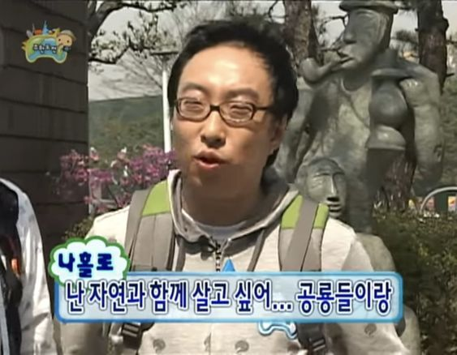

 

1. 실무에서 멀어진 지 오래된 분들과 일하는 건 솔직히 고역이다. 회사의 대표나 임원, 업계에 오래 몸담은 선배들 중에 그런 분들이 유독 많다.

2. 그들이 꼭 실무를 해야 하는 건 아니다. 잘 해야 하는 것도 아니고. 다만 실무를 잘 알지도, 제대로 해본 적도 없다면 그건 좀 다른 문제라고 생각한다.

3. 실무 말고 그들이 해야 하는 역할은 분명히 있다. 그것도 실무와는 한참 거리가 먼, 실무자는 절대 할 수 없는 종류의 일. 판을 깔고, 사람을 모으고, 마지막에 책임을 지는 일 같은 것.

4. 그런데 문제는 늘 반대편에서 터진다. 디테일을 전혀 모르기 때문에 생기는 문제들 말이다.

5. 실무를 모르는 관리자는 현실을 고려하지 않은 목표를 세운다. 그리고 그 간극을 메꾸는 건 언제나 실무자의 몫이다. ‘그냥 이렇게 저렇게 하면 되는’ 일의 과정에, 눈에 보이지 않는 그 자잘한 일들에 얼마나 많은 시간과 사람이 들어가는지. 그리고 그 일들이 본인이 하는 일만큼이나 중요하다는 것을... 잘 모르는 것 같달까? 

6. 특히 작은 조직에서 실무를 모르고, 실무를 못하는 리더는 정말 최악이자 죄악이다. 벌려 놓은 일을 제대로 하는 것이 아니라 수습하기 바쁘다. 사실 수습이라도 하면 다행이다.

7. '어떻게든 잘 될 거야'라는 말은, 같이 밤을 지새우는 동료끼리나 할 수 있는 말이다. 아침에 출근해 결과만 확인하는 사람이 할 말은 아니니까. 잘 된다면 관리자는 나가서 자랑도 하고 조명도 받겠지만, 잘 되든 안 되든 실무자는 이러나 저러나 고통 받는 운명이 아닐까..

8. 아직까지도 실무에 파묻혀 살면서 나를 갉아먹는 것 같은 괴로움을 느낄 때가 있다. 이 손을 놓지 않으면 영영 여기에 머물러 있게 되는 건 아닐까, 싶은 순간들. 그런 생각을 하면서도 또 손을 놓지 못하는 게 실무자라는 사람들의 이상한 습성인 것 같기도 하다.

9. 그렇다고 실무는 모른 채 말만 많은 리더가 되고 싶지는 않다. 내가 그렇게 힘들어했던 바로 그 사람이 되는 건, 더 싫으니까.

10. 일론 머스크는 모든 IT 관리자가 업무 시간의 최소 20%는 직접 코딩에 써야 한다고 했다. 맞는 말이다. 개발에서 손 뗀 지 오래된 사람이 지금의 제품을 잘 만들 수는 없다. 물론 20%라는 숫자가 정답인 건 아니다. 중요한 건 시간의 양이 아니라, 현장의 감각이 손끝에 남아 있느냐일 테니.

11. 그런 점에서 지금 느끼는 이 괴로움도, 언젠가 좋은 리더가 되기 위해 미리 치르는 수업료 같은 것인지도 모르겠다. 무능하고 현실감 없는 사람들을 떼로 만나는 요즘, 거기까지는 내 일이 아닌 척 뒷짐 지고 있는 리더같지 않은 사람들에게 환멸을 느끼며 쓰는 일기..

 

