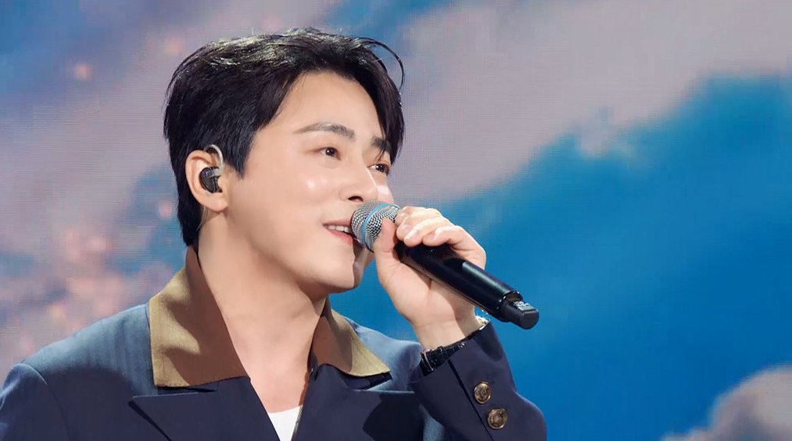
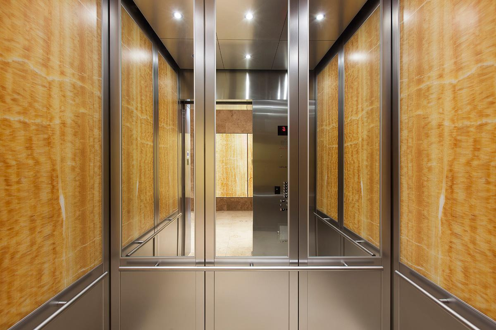

### 정석은 없다


사업을 운영한다는 것은 문제해결의 연속이다. 어떤 문제를 어떻게 해결할 것인지 매일 판단하고 결정한다. 원인이 명확하고 작은 문제들도 있지만, 현상에 가려져 복잡한 원인이 엮인 문제들도 있다. 원칙을 중요하게 생각하고 분석적인 편인 나는 문제의 원인을 신중하고 정확하게 파악한 후에, 문제의 원인을 제거하거나 개선하는 ‘정석적인 방법’을 선호했다.


하지만 IT 서비스를 운영하게 되면서 알게 된 건 ‘모든 상황에 통하는 정석’이란 애초에 없다는 사실이었다. 최고의 해법, 최적의 해법이 꼭 교과서적인 방법일 필요는 없다는 것이다. (아마 나에게 일어난 가장 큰 변화 중 하나)



*조정석은 있다.>!!!*


<br>


### 문제의 핵심을 파악하는 것은 언제나 중요하다


문제의 핵심을 파악하는 것은 중요하다. 문제를 제대로 정의하는 것이 답을 찾는 유일한 시작이다. 일을 하다 보면 어느 순간 휩쓸릴 때도 있다. 그럴 때에 “그래서 지금 어떤 문제를 해결하고 있는가?”라는 질문은 항상 중요하다. 





PM, PO들이라면 한 번 쯤 들어보았을 ‘엘레베이터 문제’도 문제의 핵심을 파악하는 것의 중요성을 이야기한다. 건물 입주자들이 엘레베이터 대기 시간이 너무 길다고 불평하는 상황에서, 문제를 어떻게 해결할 것인지에 대한 이야기이다.


대부분의 관리자는 엘레베이터 속도를 높이기 위한 방법을 생가할 것이다. 새 엘레베이터를 설치하거나, 부품을 교체하는 식이다. 하지만 진짜 문제는 엘레베이터 속도가 아니라 시간에 대한 인식이라는 점을 깨닫고, 엘레베이터에 거울을 설치하여 사람들의 주의를 분산시켜 불평이 없어졌다는 이야기다. 


제품(Product)을 운영하는 담당자에게, 현상만 보지 말고 문제의 본질을 파악하라는 교훈을 주는 대표적인 사례이다. ‘대기시간이 길어서 불만인 현상’의 문제를 어떻게 정의했느냐에 따라 해결방식이 달라진다. 문제현상만 보고 ‘엘레베이터가 느리다’로 정의한다면 엘레베이터의 속도를 개선하고자 할 것이다. 알고보니 속도는 문제가 아니었으니 ‘엘레베이터를 기다리는 시간이 길다(지루하다)’로 문제를 정의한 천재가 전세계 엘레베이터에 거울을 붙이고 공사비를 아껴주었다.


문제를 정의하는 것이 어렵다면 ‘문제 재구성 기법’을 적용해보는 것이 꽤 도움이 된다. 해결책을 찾으려는 열망에 사로잡혀 문제의 본질을 파악하는 중요한 단계를 간과하는 경우가 많다며, 문제 재구성(Reframing)을 통해 문제의 정확한 원인을 찾아내는 방법을 소개한다.

> 
>
> 7 Practices to Master Effective Problem Reframing
> 효과적으로 문제를 재구성하는 7가지 방법
>
> 1. Establish Clarity: 문제를 명확하게 이해한다
> 2. Seek External Insights: 외부의 시선을 빌린다.
> 3. Write it down: 글로 적어본다. 문제의 다양한 관점을 파악하는 데에 도움이 된다.
> 4. Uncover Gaps: 아직 다루지 못한 측면은 없는지 살핀다.
> 5. Gategorize Complexity: 복잡한 문제를 구조화한다. (샌드위치를 통째로 보지 않고 단면을 보는 것처럼)
> 6. Embrace Positive Anomalies: 문제가 발생하지 않은 예외 상황을 살펴본다. 왜 문제가 발생하지 않았을까?
> 7. Question Purpose: 문제 자체에 질문하며 근본적인 이유를 찾는다. ‘왜?’로 드릴다운 하는 것
>

[bookmark](https://medium.com/@_thefuturedesign_/unlocking-creative-solutions-are-you-solving-the-right-problems-9325a86d3e4d)


<br>


### 하지만 정말로 ‘시간에 대한 인식’이 문제의 본질이었을까?


다시 엘레베이터 문제로 돌아가서, ‘문제의 본질’에 대해서 다시 생각해보자. 그 본질이 정말 인식이었을까?


엘레베이터는 아무런 문제가 없는데 사람들의 조급한 마음이 문제였을까, 아니면 엘레베이터에게도 약간의 문제가 있었을까?


사실 둘 다 문제일 수 있다. 오히려 엘레베이터를 수리하는 것이 본질적인 해결방법에 가까울 수 있다. 


하지만 중요한 건 ‘문제의 본질’을 파악하고 근본적인 해결책을 제안하는 것을 넘어, <u>‘문제를 제대로 정의’하는 것</u>이다. _**여기서 ‘제대로’란 문제를 완벽하게 파악하라는 것이 아니라, 나에게 맞게 프레이밍하는 것이다**_. 나는 느린 엘레베이터를 수리할 수 있는 사람인가, 또는 기다리는 시간을 지루하지 않게 해줄 수 있는 사람인가를 고려해, 내가 가장 효과적이고 효율적으로 해결할 수 있는 방식으로 문제를 재정의해야 한다는 말이다.


> 💰 만약 엘레베이터를 만드는 회사 건물이었다면, 몇 작업자들이 내려가 속도를 높이는 작업을 하는 것이 더 빠르고 효율적인 선택지였을지도 모른다  
> (여기서 드는 합리적인 의심… 엘레베이터 문제의 주인공은 거울공장 사장님이 아니었을까…..)


내가 사업을 운영하면서 느끼는 건, ‘문제의 본질’을 파악한 후 그 다음이 더 중요하다는 것이다. 나에게 유리한 방향으로, 나에게 주어진 상황에서 가장 효과적이고 효율적으로 문제를 해결하는 것이다. 때때로 그 해결방법이 문제의 본질을 건드리지 못할 때도 있다. 그럼에도 불구하고 더 좋은 해결책이 되기도 한다.


<br>


### 정석은 없다, 최선만 있을 뿐!


작은 기업들의 현실은 대체로 시간도 부족하고 인력도 부족하고 예산은 늘 빠듯하다. 아무리 문제를 잘 파악하고 잘 정의한다고 하더라도, 더 고민할 여유가 없거나, 혹은 애초에 불가능한 선택지들이 대부분인 상황도 많다. 가끔은 최선이 아니라 차악을 선택해야 하는 경우도 발생한다.


처음에는 나도 문제의 본질을 건드리지 못했다는 것에 스트레스와 혼란을 겪기도 했다. ‘내가 제대로 하고 있는 건가?’하는 생각에 사로잡혀 괴롭기도 했다. 투자를 받으면 해결이 될까 싶기도 했다. 하지만 지금의 내가 내린 결론은 결국 모든 해결방법은 문제정의와 내부리소스와 외부환경, 이 3박자를 맞추는 과정이라는 것. **모든 상황에 통하는 정석적인 방법은 애초에 없다.**


다만 내가 잊지 않으려고 했던 것은 ‘차악을 고를 수 밖에 없었던 이유’에 대해 생각하는 것이다. 왜 그런 선택을 할 수 밖에 없었는지, 이런 상황이 반복되지 않기 위해 무엇을 해야 하는지, 이번 선택으로 충분히 해결하지 못한 문제 지점들을 고민하고 기록한다.


원문에서 기울어버린 대지에 집을 새로 짓는 것이 해법이 아니라 또 다른 골칫거리가 된다는 사례를 든다. 하지만 우리는 언제나 기울어진 집을 허물고 토지를 다시 다지는 결정을 할 수는 없다. 대신 대지가 기울어졌다는 점을 인지하고, 위험요소들을 더 꼼꼼하게 모니터링하면서, 그 집을 떠나거나 혹은 기초공사를 할 준비를 할 수는 있다.


이미 항해를 시작해서 망망대해에 떠있는 배에 생긴 구멍을 열 손가락으로 막는 것이 좋은 방법은 아니겠지만, 그것이 다음 경유지까지만이라도 안전하게 도착할 수 있는 가장 좋은 방법이라면 기꺼이 그런 선택을 할 수도 있는 것이다.


그렇게 공사 대신 거울을 하나씩 더 붙여보면서, 다음 경유지에서 정비해야 할 것들을 적어보면서, 매번 조금씩 나아지고 있는 건지도 모르겠다!


<br>


```toc
```
