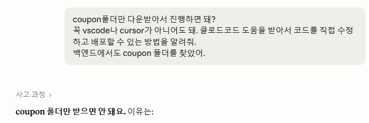
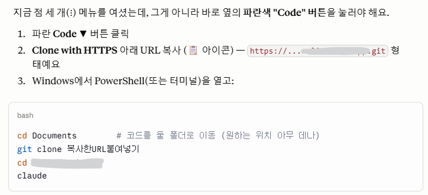
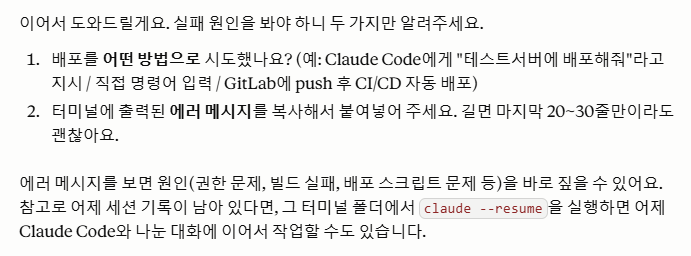
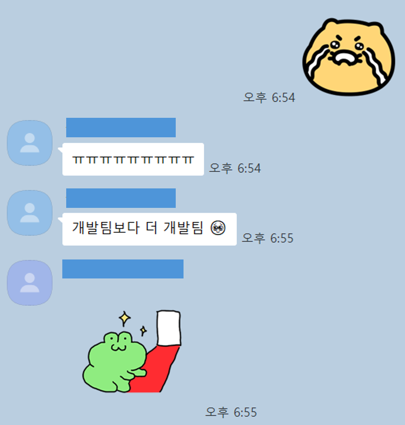

> 🔥 “다른 작업이 밀려 있어서 일주일 후에 착수 가능하고, 작업기간도 일주일 정도 예상합니다.”  
> 프로모션 진행을 위해 당장 기능에 대한 확인이 필요했던 터라 막막했다.  
>   
> 그냥 기다려야 하나? 아니면 프로모션을 취소해야 하나?  
>   
> 내가 이 서비스 주인인데… 권한도 모두 가지고 있는데… 들여다 보기라도 할까?  
>   
> 짧은 고민 끝에, 클로드를 믿고 한 번 도전해보기로 했다.


## 안 되면 되게 하라, 그것이 PM의 길…


개발팀에 쿠폰 기능 개선을 요청했더니 돌아온 답은 “2주”였다. 착수까지 일주일, 작업에 다시 일주일. 개발자 입장에서는 합리적인 일정이었다. 다른 작업들이 우선순위에 있었고, 쿠폰 기능은 그 줄의 맨 뒤였다. 문제는 내 쪽 사정이었다. 프로모션 일정은 이미 잡혀 있었고, 그 안에 기능이 동작하는지 확인해야 했다. 2주를 기다리면 프로모션 자체가 무산될 상황이었다.


개선이 필요했던 기능은 쿠폰 발급 로직이었다. 기존에는 쿠폰 하나에 한 명만 쓸 수 있는 구조였는데, 이번엔 **하나의 코드를 여러 명이 선착순으로 사용**하고, **사용 인원에 상한을 두고**(예: 3명까지), **운영자가 원하는 문자열로 코드를 지정**하고, **한 사람이 같은 코드를 두 번 쓰지 못하게** 막는 것까지 필요했다. 분명 개발자 입장에서는 어렵지 않을 것 같은데… 코드를 모르니 그냥 손을 놓고 있어야 한다는 게 답답했다.


아마도 최근의 **바이브코딩** 경험이 ‘나도 할 수 있을 것 같은’ 근거 없는 자신감을 쌓아 올렸던 것 같다. 바이브코딩은 몇 차례 해 봤지만, 내가 운영하는 실제 서비스의 코드를 직접 건드리는 건 처음이었다. 서버부터 DB까지 모든 root 계정을 가지고 있었지만, 그동안 한 일은 모니터링과 조회 정도였지 코드를 수정해 본 적은 없었다. ‘권한이 있다’와 ‘할 줄 안다’는 전혀 다른 이야기였다.


그래도 한 번 해보기로 했다. **클로드코드**를 믿고 깃랩에 로그인했다. 이 글은 그 이틀의 기록이다. 비개발자가 운영 서비스의 기능을 실제로 배포하기까지 어떤 과정을 거쳤고, 어디서 막혔으며, 그 경험에서 무엇을 얻었는지를 최대한 솔직하게 정리했다. 나처럼 **AI**로 바이브코딩에 도전하려는 비개발자, 기획자, 관리자에게 작은 참고가 되면 좋겠다.


---


## 순조로운 출발


### coupon 폴더를 찾아서


다행히 이전에 작성해 둔 기능명세가 있었다. 처음 구현한 게 2년 전, 이후 몇 차례 개선 시도가 있었지만 제대로 마무리되지 않았던 기억이 났다. 최신 버전인지는 알 수 없었지만, 기능의 대략적인 구조를 파악하는 데에는 문제가 없었다. 기능을 개선하려면 이 문서가 지금 코드와 맞는 내용인지부터 확인해야 했다.


깃랩에 들어가 ‘coupon’ 폴더를 찾았다. 구조를 뜯어본 적이 없으니, 예상되는 폴더명을 일일히 눌러가며 찾았다. 다행히 구조가 아주 깔끔하게 잘 정리되어있었다!! 어렵지 않게 찾아서 코드도 조회해볼 수 있었다. 코드를 그대로 클로드에 복붙해서 현재 개발 상태를 확인했다. 운영자가 원하는대로 쿠폰명을 지정할 수 있게 설정이 되어있다는 점은 확인했고, 다른 기능들은 수정/업데이트가 필요했다. (여기서 일단 1차로 속이 시원해졌다ㅠ)


그런데 그다음이 문제였다. 이걸 다운로드 받아서 고치는 건가? 어디서 고치는 거지? 정말 아무것도 몰랐다. 지금 다시 생각하면 멍청한 질문이지만.. 클로드에게 물어봤다. 





내가 vscode나 cursor가 아니어도 된다고 얘기해서 그런지, 클로드가 터미널에서 작업하는 방법을 알려줬다. (다음번에 작업하면 에디터를 사용하는 편이 낫겠다는 생각이긴 하다..) 폴더도 어떻게 다운로드 받아야하는 지 몰라서 하나하나 물어봐가며 진행했다.


클로드에게 더 자세하게 설명해달라고 하면 아주 자세히 설명해준다. 꽤나 친절하게. 다만 대부분 서비스들이 계속해서 변하기 때문에… 클로드가 서비스 화면을 100% 설명하지는 못한다. 버튼 위치가 틀리거나 이름이 살짝 틀릴 수 있다. 알잘딱깔센으로 알아들어야 함.





터미널로 클로드코드에 접속하고 난 이후에는 터미널에서 직접 클코와 대화하며 진행했다.


지금 이 상태에서 뭘 해야 하는지, 이 용어는 무슨 뜻인지, 하나하나 물었다. 모르면 물어보면 된다는 게 이번 작업 내내 통한 원칙이었다. 클로드코드가 현재 코드를 읽고 구조를 파악해 줬고, 이러저러하게 고쳐 달라고 하니 고쳐 줬다. 내가 코드를 몰라도, 클로드가 코드를 읽고 나에게 한국어로 설명해 주는 구조였다. 이 방식이 통한다는 걸 깨달은 순간, 막막함이 조금 줄었다.


### 코드 수정 So Easy!! 무적의 클로드코드


코드를 ‘짜는’ 단계는 놀랄 만큼 수월했다. 클로드코드에게 어떻게 바꾸고 싶은지(To-be)를 전달했더니, 현재 상태를 확인하고(As-is) 이러저러하게 바꾸겠다고 알려줬다. 다회 사용을 위한 항목을 추가하고, 사용 횟수를 세는 로직을 넣고, 1인 1회 제한을 거는 작업까지 요청했다.


클로드코드를 사용할 때, 되도록 요청사항을 구체적으로 미리 정리해두고 클로드코드에서 실행하는 편이다. 클로드코드에게 수정사항을 요청했을 때에 따로 확인받지 않고 바로 코드에 수정해버린 후에 알려주는 경우들이 발생핬다. 어떤 경우에는 이 방식이 너무 편하고 좋지만, 요청사항을 뭔가 빼먹었거나 수정이 필요할 때에는 전체 코드 수정을 반복해야 하는 번거로움이 생긴다. 시간도 시간이지만 토큰을 엄청나게 잡아먹는다. 그래서 요청사항을 미리 구체적으로 정리해두고, 이 요청사항을 클코에 전달하면서 ‘바로 수정하지 말고 수정방향을 먼저 알려달라’고 요청한다. 그 내용을 확인하다보면 뭔가 빼먹은 것들이 생각나기도 하고, 안해도 될 것들이 생각나기도 한다. 되도록 수정할 내용들을 이해하고, 어떤 파일들을 건드리는지 대략 확인을 한 후에 ‘해도 되겠다’라는 생각이 들면 수정하도록 한다.


클로드코드가 쿠폰 코드를 수정하는 데에는 1분도 걸리지 않았다. 기존 DB에 `code`(지정 코드), `max_uses`(최대 사용 인원), `used_count`(현재 사용 횟수) 같은 항목이 더해졌다. 무슨 뜻인지 물으면 그때그때 풀어 설명해 줬기 때문에, 코드를 읽지 못해도 ‘지금 뭘 바꾸고 있는지’는 따라갈 수 있었다. (내가 DB에 대한 이해가 있어서 좀 더 수월했을지도 모르겠다.)


여기까지는 나름 순조로웠다. 바이브코딩을 하면서 나에게 가장 어려운 부분들이 남아있었다.





## 시작만 쉬웠음;


### 첫 번째 허들: 하라는 대로 했는데 웨않돼


“마이그레이션이 필요해요.” 클로드가 말했다. 마이그레이션, 개발자들이 해야된다고 하는 걸 들어는 봤는데 정확하게 뭔지는 몰랐다. (내가 직접 하게 될 줄은 더 몰랐다.) 클로드의 지침을 반쯤 이해한 상태로, 일단 하라는 대로 착실히 따라했다. 그런데 막상 해보니 에러가 났다.


오류 내용을 그대로 복붙해서 알려줬더니 클로드가 원인을 짚고 대안을 제시해 줬다. 하지만 계속 오류가 나는 것이 아닌가? ‘문제를 정확히 파악했어요’, ‘이제 원인이 명확해요!’라고 하면서 그대로 시도하면 또 에러가 났다. 점점 인내심의 한계에 다다르고 있었다. 클로드는 계속 해결책을 내놓고 있었는데, 어쩐지 문제를 겉돌고 있는 것 같았다. '이 방법이 맞는 건지, 계속 따라가도 되는 건지' 의구심이 스멀스멀 올라왔다. 오류코드만 전달할 것이 아니라 근본적인 뭔가를 해결해야 한다는 느낌을 받았다.


클로드에게 오류보고를 멈추고, 대신 상황을 자세히 전달했다. _‘아마도 너가 제안한 수정과 새로운 설정들이 없어도 될 거야.. 왜냐하면 이미 개발자들이 사용했었고 사용하고 있거든. 내가 처음이라 문제인거야…’_ 라고 이야기하며 혹시나 참고가 될까 구조도를 전달했다. 운이 좋게도 혹시나 하는 마음으로 전달한 것이 열쇠가 되었다.


클로드가 틀린 건 아니었다. 클로드가 모든 구조를 꿰고 있지 않으니, prisma(마이그레이션 도구)가 같은 폴더에 있다고 가정하고 엉뚱한 해결책들을 전달하고 있었던 것이 문제였다. (클로드가 알고 있는 것이 일반적인 방법인데, 우리 프로젝트에서 좀 다르게 세팅이 되어있었던 것 같다) prisma가 내가 작업하던 `apps/backend` 폴더가 아니라 옆의 `db` 폴더에 따로 설치돼 있었고, 테스트 서버가 개발용(`development`)이 아니라 운영용(`production`) 설정으로 돌고 있었다. 클로드는 그걸 알 방법이 없었고, 나도 물론 몰랐다. 그러니 내가 넣는 명령은 계속 빗나갔던 것이다.


정확한 원인을 파악하자, 30분 넘게 씨름하던 것이 단 번에 해결되었다. 기존에 운영하던 구조와 규칙을 어느 정도 파악하고 있어야 오류가 발생했을 때에 더 빠르게 문제를 해결할 수 있다는 점을 다시 한 번 느꼈다.


### 두 번째 허들: 비개발자에게는 배포가 항상 어려워


마이그레이션이 통과했다고 끝이 아니었다. 바뀐 DB 구조를 코드가 실제로 인식하게 하려면 ‘클라이언트’라는 걸 다시 생성해야 했고, 그다음 백엔드 프로그램을 재시작해야 했다. 재시작 뒤에는 로그를 띄워 ‘database connected’, ‘Listening on’ 같은 줄이 제대로 찍히는지 눈으로 확인했다. 모든 코드를 이해할 필요는 없다. ‘connected’ 같은 주요 단어들만 보거나, 빨간글씨가 나오는지 안나오는지만 봐도 이게 된 건지 안 된 건지 대략 알 수 있다.(물론 완전하지 않지만)


비개발자가 느끼기에 코드 자체를 수정하는 것 보다 수정한 내용을 배포하는 것이 제일 어렵다. 가장 많이 오류가 나는 부분도 Git과 관련한 부분인 것 같다. 언제쯤 클로드한테 물어보지 않고 git push를 할 수 있을지.. 그런 날이 올까?


### 세 번째 허들: 코드에도 없고 깃랩에도 없는 파일


배포까지 끝내고 “이제 됐다” 싶어 테스트에 들어갔다. 쿠폰을 하나 만들어 휴대폰으로 등록을 시도했는데, “Oops!” 에러 모달이 떴다. 쿠폰 생성이 잘못된 건지, 쿠폰 상태를 확인했지만 쿠폰은 정상적으로 등록이 되어있었다.


클로드에게 오류를 전달하니 ‘서버 로그’를 봐야 한다고 했다. 로그를 실시간으로 띄워 놓고 다시 등록을 시도했다. 특정 JSON 파일이 없어서 나는 500에러였다.


이 파일은 쿠폰 등록 실패 횟수를 기록하는 ‘런타임 데이터 파일’이었다. 그런데 이 파일은 의도적으로 깃(git)에서 제외돼 있었다. 코드 이력을 보니 과거에 “json db 파일 삭제, gitignore 추가”라는 흔적이 있었다. 즉 코드를 아무리 내려받아도 이 파일은 따라오지 않고, 서버에 직접 만들어 줘야 하는데 테스트 서버엔 그게 없었던 것이다.


빈 파일을 하나 만들어 주자 에러가 사라졌고, 그제야 쿠폰 등록 모달이 정상적으로 떴다. 이 오류도 클로드가 코드를 아무리 잘 읽어도 사전에 알 수 없는 종류의 문제였다. ‘이 파일은 코드에 없지만 서버에는 있어야 한다’는 건 코드가 아니라 우리 팀의 운영 규칙이었던 것이다.


## 감격의 테스트 배포 완료, 그 후 가장 먼저 한 일(매우 중요)


### QA는 누구보다 빠르게, 검증까지 챙겨주는 클로드


그렇게 시행착오 끝에 테스트 서버 배포에 성공했다. 이제 기능이 의도대로 동작하는지 검증할 차례였다. 테스트 DB에 ‘최대 3명까지’ 쓸 수 있는 쿠폰을 하나 만들고, 팀원들에게 쿠폰 등록 테스트를 요청했다. 여러 명이 같은 코드를 선착순으로 쓰고, 정해진 인원에서 마감되고, 한 사람은 한 번만 쓸 수 있는 — 원하던 동작이 모두 확인됐다.





진짜 이걸 내가 했다고? 말 그대로 감격이었다.
개발 일정 때문에 못 할 뻔했던 프로모션도 바로 진행할 수 있게 됐다.


본서버 업로드는 개발자에게 맡기기로 했다. 사고 발생 시 내가 수습할 수 없을테니…


### ⭐까먹기 전에 기록하기


배포가 끝나자마자 기능명세를 최신 내용으로 업데이트하고, 이번에 겪은 시행착오와 주의할 점을 따로 정리했다. 우리 팀의 마이그레이션 방식, 막혔던 지점, 해결 방법까지. 대화 내용을 바탕으로 클로드가 정리해 준 내용을 검토하고, 부족해 보이는 부분은 좀 더 자세하게 내용을 채워달라고 했다.


코드에 익숙하지 않기 때문에 분명히 다음 번에 기억하지 못할 것이라 생각하고… 기능 검증에 필요한 주요한 코드들은 예시를 써두고, 테이블의 주요 컬럼들에 대한 설명도 추가했다. 무엇보다 이번에 마이그레이션 과정이나 배포에서 겪었던 오류들과 시행착오, 해결방법을 꼼꼼하게 정리했다.


다음에 또 작업할 일이 생기면 클로드에게 이 노션 페이지부터 읽힐 생각이다. 


---


## 어쩌면 코딩 실력보다 중요한 것은


#### AI와 나의 역할분담: SS급 코더와 일하기


오류가 발생한 대부분의 원인은 코드 자체가 아니었다. 팀의 마이그레이션 방식, 도구 설치 위치, 운영용 서버 설정, 깃에서 제외된 런타임 파일 같은 시스템의 규칙들을 몰라서 발생한 문제들이었다.


클로드코드가 SS급 코더라면, 내가 해야할 일은 SS급 코더를 잘 활용하는 역량을 키우는 것이 아닐까 하는 생각이 들었다. 용병을 투입하는 감독처럼. 용병이 잘하는 일을 용병보다 더 잘하기 위해 노력하는 것이 아니라, 시스템에 대한 이해도를 높여서 제대로 지시할 수 있도록 해야겠다.


#### AI에게도 맥락을 공유해줘야 한다


요구사항을 명확하게 하는 것도 중요하지만, 왜 이렇게 요청하는지에 대한 맥락을 제공했을 때 더 좋은 답변이 나왔다. 특히 오류가 발생했을 때에 원인을 찾거나 해결방안을 제시할 때에, 기존에 제공한 ‘맥락’이 영향을 미치는 것 같아.


물론 문제도 있다. 모든 문제의 원인을 거기서 찾으려고 하기도 한다는…. 너무 많은 정보를 줘도 문제일까. 이 부분은 시행착오를 좀 더 겪으며 최적의 방법을 찾아가는 중이다.


#### 결국 PM이 하던 일과 비슷하다


수많은 에러 앞에서 포기하지 않고 끝까지 가는 것. 질문을 좁혀가며 문제를 파악하고 원인을 찾는 것. 리스크를 관리하고 내용을 정리하는 것. 결국에는 ‘일이 굴러가게 만드는’ 것. 바이브코딩은 어쩌면 기획자가 더 잘 할 수 있는 일일지도 모르겠다.


안 되면? 되게 하면 된다!


```toc
```
