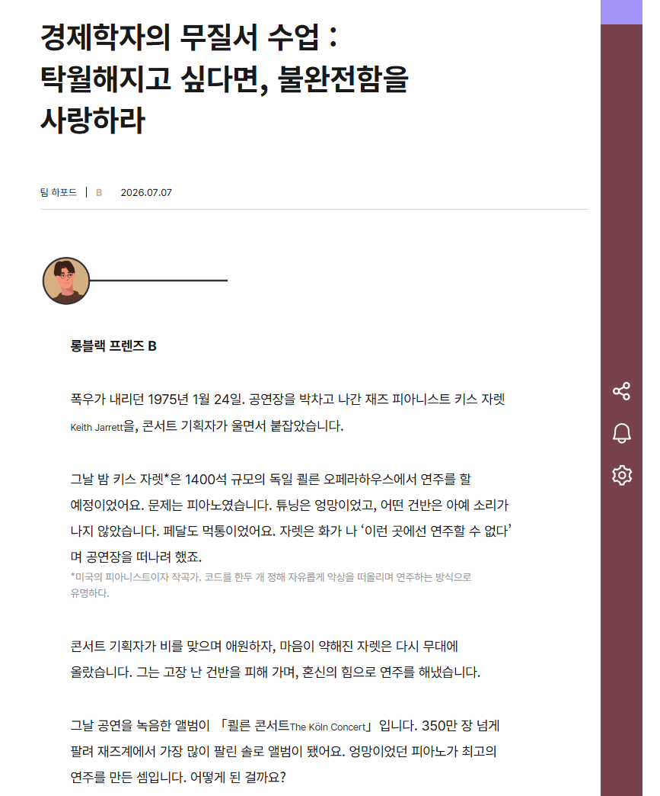
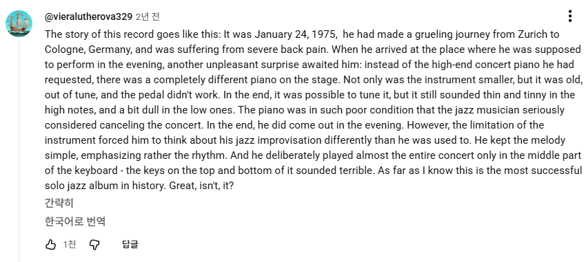

> ❓ 이 글은 우연히 롱블랙에 실린 글을 공유받아 읽고, 화가 나서(정확히는 열폭해서) 쓰는 글입니다.


## 엉망이었던 피아노가 최고의 연주를 만든 셈?



*롱블랙은 아마도 잘못이 없다..!*


<br>


키스 자렛 이야기는 사실 원래 알던 일화다. 고장 난 피아노 연주로 만들어진 태어난 명반. ‘엉망이었던 피아노가 최고의 연주를 만든 셈’이라는 표현이 내 심기를 건드렸다.


예상 밖의 변수가 끼어드는 순간, 집중력이 치솟고 새로운 방식으로 상황을 헤쳐나갈 수 있는 어떤 힘이 발휘될 수도 있다는 것에는 공감한다. 인간을 한계까지 밀어붙여 최선을 다하게 하는 상황이 때로는 더 좋은 결과물을 만들어내기도 한다.


그런데 이렇게 '탁월해지고 싶다면 불완전함을 사랑하라'는 식으로 풀어놓으니… 솔직히 좀 짜증이 났다.


난관 앞에서 사람은 종종 자기도 몰랐던 힘을 꺼내 쓴다. 그렇게 경험이 쌓이고 성장한다. 나 역시 그런 순간들을 많이 겪어왔고 지금도 겪고 있다. 때로는 그런 어려움을 즐기고, 성장하는 순간의 쾌감을 좋아하기도 한다.


문제는 ‘그럼에도 불구하고’ 탁월한 연주를 해낸 키스 자렛이 아니라, 고장난 피아노를 거기에 갖다 놓은, 그걸 한 번 확인하지도 않은 그 콘서트 기획자이다. 


_솔직히 기획자라고 부르면 안되는 거 아닌가? 기획자라고 불릴 자격이 없다_



*키스자렛 앨범 유튜브에 달린 댓글. “Not only was the instrument smaller, but is was old, out of tune, and the pedal didn’t work. The piano was in such poor condition that the jazz musician seriously considered canceling the concert.”*


<br>


## “저번에 키스 자렛은 잘만 하던 데요?”


10년 넘게 일하며 수도 없이 봤다. 주니어든 시니어든, '없어도 되는 변수'를 굳이 만들어 내는 사람들. 당연히 본인이 해야할 일을 하지 않았거나 잘못 처리해서 문제를 만들어 놓고는, 누군가의 초인적인 분투로 그게 덮이면 자기가 뭘 잘못했는지 조차 모르는 사람들. 그런 사람들은 높은 확률로 그런 상황에서 고맙다는 말도, 미안하다는 말도 제대로 할 줄 모른다. 고마운 줄도, 미안한 줄도 모른다는 말이 더 맞겠다. 이번에 사고가 안 났으니, 다음번에도 똑같이 한다. 정말 높은 확률로.


더 심한 건, 똑같이 반복된 상황에서 문제를 인식하지 못한다는 것이다.

> “거 봐, 별 문제 아니잖아” (내 잘못 아님 시전)  
> “거 봐, 너 할 수 있다고 했잖아!” (응원하는 대가리 꽃밭)  
> “오히려 잘 된 거 아니야?” (니가 뭔데)

놀랍게도 셋 다 들어봤다. 최악은 이 멘트가 아닐까…


_**“저번에 키스 자렛은 잘 하던데요?”**_


<br>


자기 역할을 제대로 못 했는데, 누군가의 '하지 않아도 됐을' 노력 덕에 상황이 모면되거나 오히려 더 좋게 풀렸을 때—그 사람이 진짜로 반성하고, 같은 실수를 안 하려 애쓸 확률이 얼마나 될까?


내 경험으로는 없다. 11년째, 아직 한 명도 못 만났다. 지위고하를 막론하고. 남의 초인적인 분투를 자기 성과로 삼고, 심지어 그걸 다음 사람에게 들이미는 기준으로 쓴다.


자기 잘못은 끝내 책임지지 않은 채로.


<br>


## 고장난 피아노 앞에 기꺼이 앉는 리더는 좋은 리더인가?


그렇다면 리더 입장에서, '하지 않았어도 될 노력'을 기꺼이 떠안아 대신 문제를 해결해 주는 게 맞나? (리더에게 ‘하지 않아도 될 노력’이 있냐 없냐는 별개의 문제)


단기적으로는 맞을지도 모른다. 일단 사고는 막아야 하니까. 고객은, 무대는, 기다려주지 않으니까. 나 역시 수없이 그 피아노 앞에 앉았다. 남이 고장 낸 건반을 피해 가며, 어떻게든 소리를 냈다. 그때는 그게 책임이라고 믿었다.


그런데 장기적으로 보면… 이게 정말 맞는 걸까?


그런 순간이 쌓이면 어떻게 될까. 대신 막아준 그 사람은 끝내 자기 몫을 배우지 못한다. 배울 기회를, 실패를 내가 매번 가로챘던 것은 아닐까? 좋은 리더가 되고 성과를 내려다가, 성장하지 않는 팀을 만들고 있는 것은 아닐까? 하는 고민이다. 시간이 아무리 흘러도 '내가 없으면 안 굴러가는 팀’으로 남아있는 것 만큼 최악인 조직이 있을까.


'없으면 안 되는 사람'은, 얼핏 유능해 보인다. 그런데 조직의 관점에서 그건 유능이 아니라 병목이자 리스크다. 내가 아프면, 내가 지치면, 내가 떠나면—그 팀은 그대로 멈춘다. 정작 나는 나대로, 하지 않아도 될 노력에 수명을 깎아 가면서.


그래서 요즘 나는 조금 다르게 생각하려 한다. 때로는 피아노가 고장 난 채로, 그 사람이 직접 무대에 서 보게 두는 것. 삐걱대는 소리를 스스로 듣게 하는 것. 그게 단기적으론 더 위험해 보여도, 길게 보면 그 사람도, 팀도, 나도 사는 길일지 모른다. 물론… 말처럼 쉽진 않다. 아직도 나는 손이 먼저 나간다.


<br>


## 내가 선택한 도전인가, 떠맡은 변수인가


잘 끝났으니 다 괜찮다는 말. 나는 이게 참… 무책임하다고 생각한다. 변수가 있었기 때문에 더 잘한 게 아니다. 어쩌면 변수가 없었다면, 더 좋은 연주가 나왔을지도 모른다. 온전한 피아노 앞에서, 온전한 컨디션으로. 우리는 그 '가능했던 최선'을 영영 알 수 없게 됐을 뿐이다.


앨범은 남았고 경험도 실력도 남았겠지. 그런데 그날 밤 그가 삼킨 스트레스는? 깎여 나간 수명은? 그건 아무도 계산해 주지 않는다. 잘 해냈으니 다 괜찮다는 말, 도움이 됐다는 말에 나는 동의하지 못한다.


그러니 이렇게 정리하기로 했다. 불완전함은, 내가 선택한 도전일 때만 사랑할 만하다. 남이 던져 놓은 고장은 사랑이 아니라 뒷수습이고—그 뒷수습을 언제 멈춰야 할지 아는 것이, 어쩌면 리더의 진짜 몫이 아닐까.


<br>


[video](https://youtu.be/skkiVoI7sBk?si=qvyDpMiYAj1Nkfzj)


오늘도 어쩔 수 없이 고장난 피아노 앞에 앉은 사람들을 위해.. 키스 자렛 음반을 조용히 추천해본다.


```toc
```
